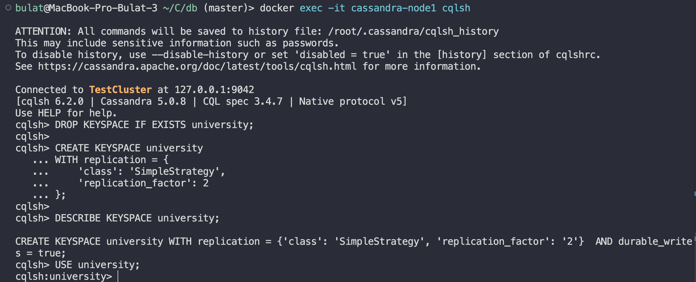
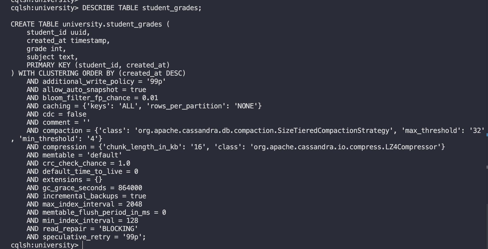
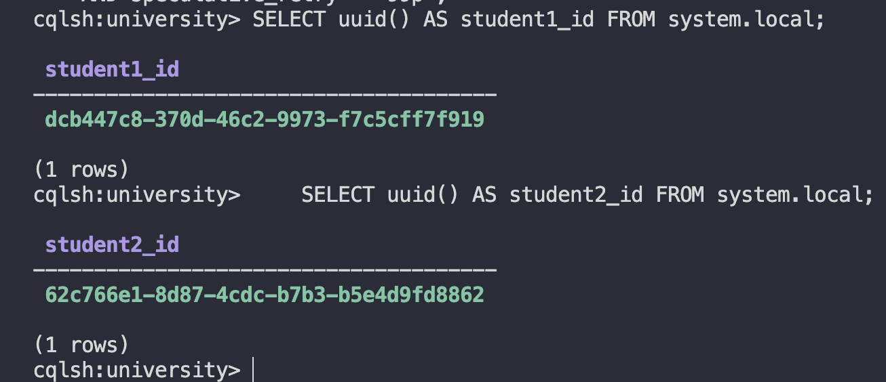
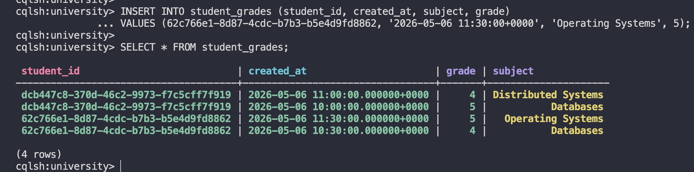
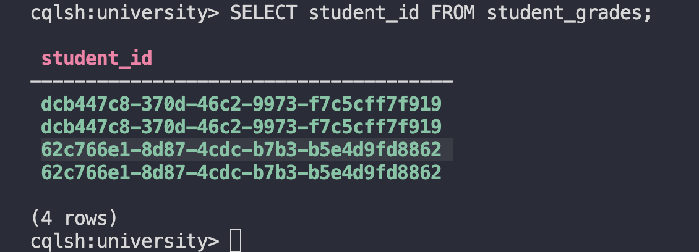
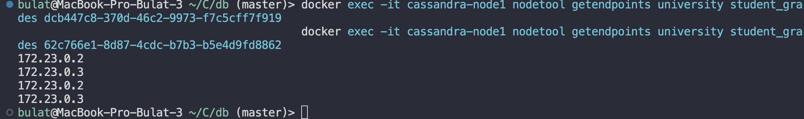
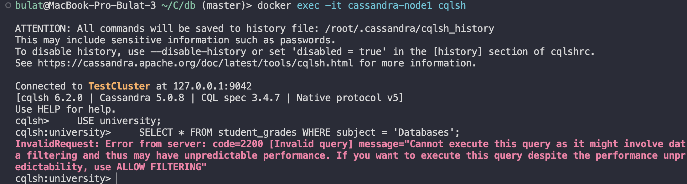
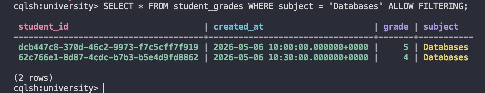

# Домашнее задание:

### Задание 1: Инициализация БД с репликацией

- Создайте файл docker-compose.yml с содержимым из readme.md, запустите его

```bash
docker compose -f docker-compose-cassandra.yml up -d
docker exec -it cassandra-node1 nodetool status
```

- Создайте Keyspace `university` с фактором репликации **2** (чтобы данные дублировались на обе ноды).

```bash
docker exec -it cassandra-node1 cqlsh

DROP KEYSPACE IF EXISTS university;

CREATE KEYSPACE university
WITH replication = {
    'class': 'SimpleStrategy',
    'replication_factor': 2
};

DESCRIBE KEYSPACE university;
USE university;
```



### Задание 2: Создание таблицы и данных

- Создайте таблицу `student_grades`: `student_id(uuid)`, `created_at`, `subject`, `grade`.
- Настройте ключи: **Partition Key** — `student_id`, **Clustering Key** — `created_at`.

```bash
USE university;

CREATE TABLE student_grades (
    student_id uuid,
    created_at timestamp,
    subject text,
    grade int,
    PRIMARY KEY (student_id, created_at)
) WITH CLUSTERING ORDER BY (created_at DESC);

DESCRIBE TABLE student_grades;
```

- Выполните по 2 вставки для двух разных студентов. Для генерации ID используйте функцию `uuid()`.



```bash
    SELECT uuid() AS student1_id FROM system.local;
    SELECT uuid() AS student2_id FROM system.local;
```



```bash
INSERT INTO student_grades (student_id, created_at, subject, grade)
VALUES (dcb447c8-370d-46c2-9973-f7c5cff7f919, '2026-05-06 10:00:00+0000', 'Databases', 5);

INSERT INTO student_grades (student_id, created_at, subject, grade)
VALUES (dcb447c8-370d-46c2-9973-f7c5cff7f919, '2026-05-06 11:00:00+0000', 'Distributed Systems', 4);

INSERT INTO student_grades (student_id, created_at, subject, grade)
VALUES (62c766e1-8d87-4cdc-b7b3-b5e4d9fd8862, '2026-05-06 10:30:00+0000', 'Databases', 4);

INSERT INTO student_grades (student_id, created_at, subject, grade)
VALUES (62c766e1-8d87-4cdc-b7b3-b5e4d9fd8862, '2026-05-06 11:30:00+0000', 'Operating Systems', 5);

SELECT * FROM student_grades;
```



### Задание 3: Проверка распределения данных (Partitioning)

- Найдите UUID ваших студентов: `SELECT student_id FROM student_grades;`.

```bash
USE university;
SELECT student_id FROM student_grades;
```



- В терминале выполните команду для получения ip нод с данными каждого UUID: `nodetool getendpoints keyspace table_name <UUID>`, посмотрите результат

```bash
docker exec -it cassandra-node1 nodetool getendpoints university student_grades dcb447c8-370d-46c2-9973-f7c5cff7f919
docker exec -it cassandra-node1 nodetool getendpoints university student_grades 62c766e1-8d87-4cdc-b7b3-b5e4d9fd8862
```



При replication_factor = 2 для каждого UUID вернулось по 2 IP-адреса нод

### Задание 4: Работа с фильтрацией

- Попробуйте выполнить поиск по предмету (не ключевое поле), зафиксируйте ошибку

```bash
    USE university;
    SELECT * FROM student_grades WHERE subject = 'Databases';
```



- Выполните этот же запрос, добавив `ALLOW FILTERING`. Посмотрите результаты.

```bash
    SELECT * FROM student_grades WHERE subject = 'Databases' ALLOW FILTERING;
```


