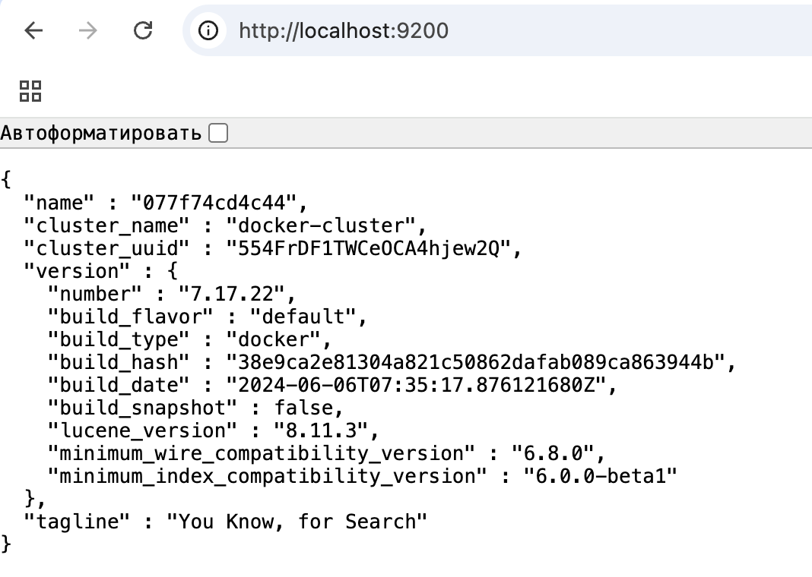
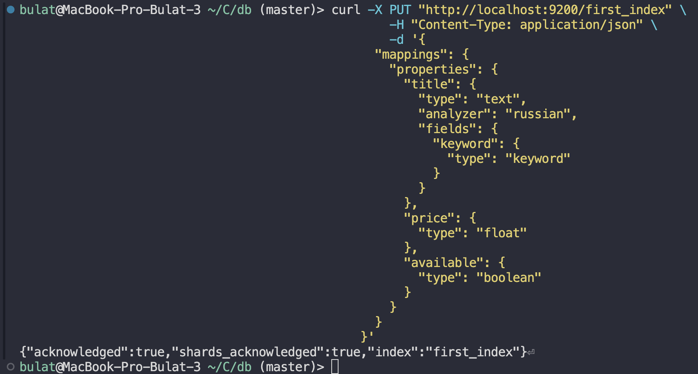
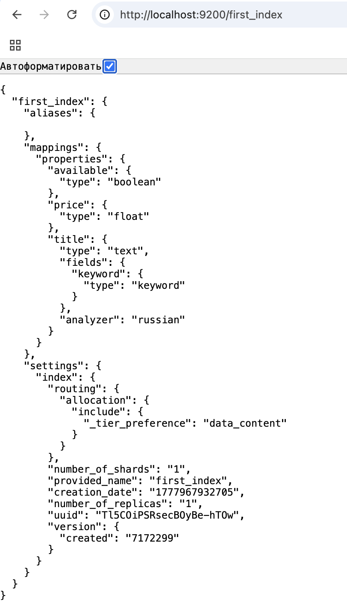
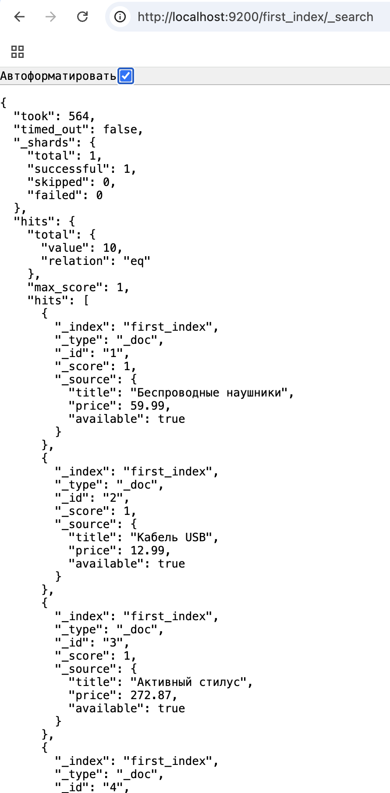
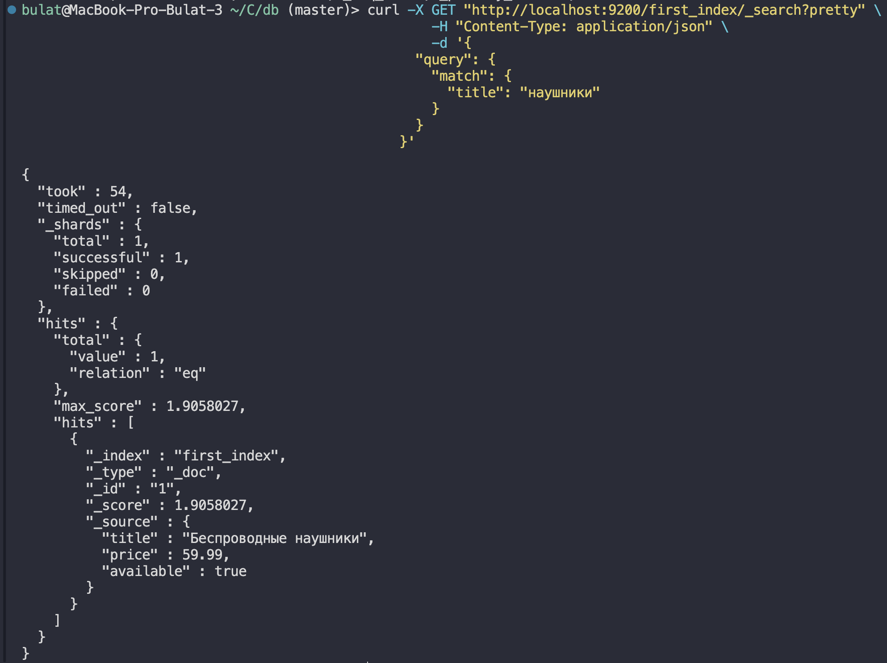
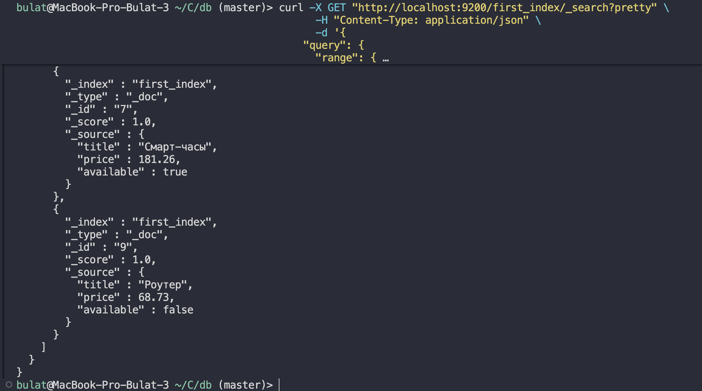
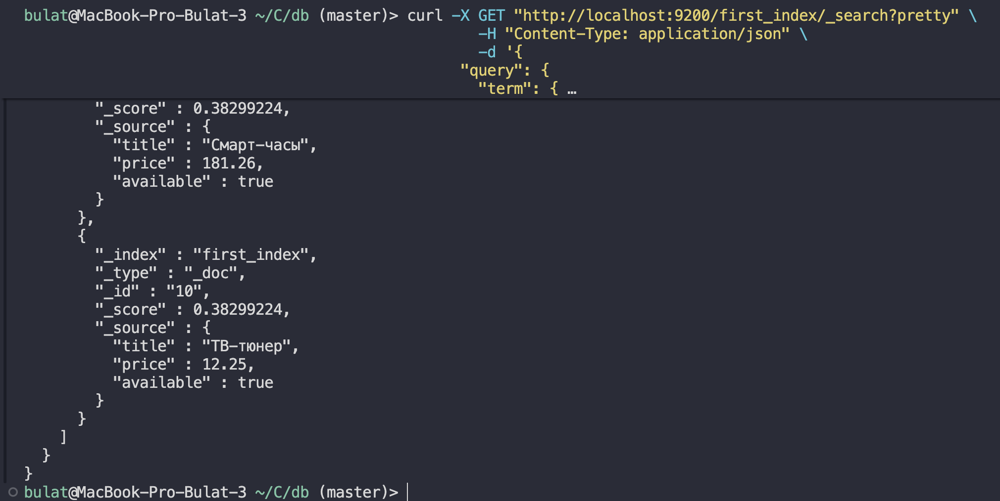
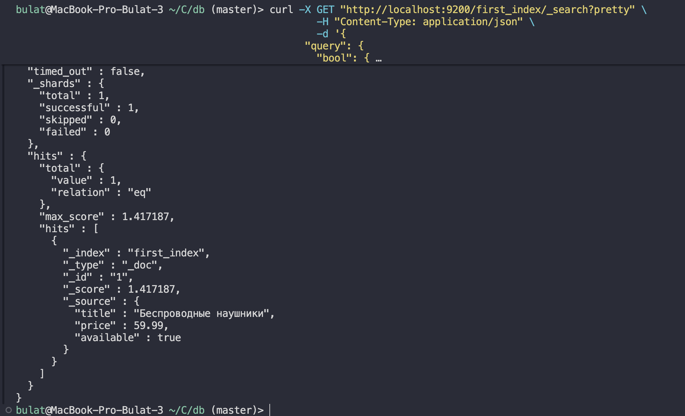

# Домашнее задание

1. Поднять Elastic

```
	http://localhost:9200/
```



2. Создать индекс

```bash
  curl -X PUT "http://localhost:9200/first_index" \
    -H "Content-Type: application/json" \
    -d '{
      "mappings": {
        "properties": {
          "title": {
            "type": "text",
            "analyzer": "russian",
            "fields": {
              "keyword": {
                "type": "keyword"
              }
            }
          },
          "price": {
            "type": "float"
          },
          "available": {
            "type": "boolean"
          }
        }
      }
    }'
```




3. Заполнить данными

```bash
	curl -X PUT "http://localhost:9200/first_index/_doc/1" \
  -H "Content-Type: application/json" \
  -d '{
    "title": "Беспроводные наушники",
    "price": 59.99,
    "available": true
  }'

	curl -X POST "http://localhost:9200/first_index/_bulk" \
  -H "Content-Type: application/x-ndjson" \
  --data-binary '
	{"index":{"_id":2}}
	{"title":"Кабель USB","price":12.99,"available":true}
	{"index":{"_id":3}}
	{"title":"Активный стилус","price":272.87,"available":true}
	{"index":{"_id":4}}
	{"title":"Кулер для процессора","price":200.14,"available":true}
	{"index":{"_id":5}}
	{"title":"Мышь беспроводная","price":94.08,"available":false}
	{"index":{"_id":6}}
	{"title":"Внешний аккумулятор","price":198.49,"available":true}
	{"index":{"_id":7}}
	{"title":"Смарт-часы","price":181.26,"available":true}
	{"index":{"_id":8}}
	{"title":"Геймпад","price":22.71,"available":false}
	{"index":{"_id":9}}
	{"title":"Роутер","price":68.73,"available":false}
	{"index":{"_id":10}}
	{"title":"ТВ-тюнер","price":12.25,"available":true}

	'
```



4. Написать 4 запроса (поиск по названию, фильтры, `match`, `range`, `term`, `bool`)

### Найти товары, где title содержит "наушники":

```bash
	curl -X GET "http://localhost:9200/first_index/_search?pretty" \
  -H "Content-Type: application/json" \
  -d '{
    "query": {
      "match": {
        "title": "наушники"
      }
    }
  }'
```



### Найти товары с ценой от 50 до 200:

```bash
	curl -X GET "http://localhost:9200/first_index/_search?pretty" \
  -H "Content-Type: application/json" \
  -d '{
    "query": {
      "range": {
        "price": {
          "gte": 50,
          "lte": 200
        }
      }
    }
  }'
```



### Найти товары, которые есть в наличии:

```bash
  curl -X GET "http://localhost:9200/first_index/_search?pretty" \
    -H "Content-Type: application/json" \
    -d '{
      "query": {
        "term": {
          "available": true
        }
      }
    }'
```



### Найти доступные товары с ценой от 15 до 100, в названии которых есть "беспроводная":

```bash
  curl -X GET "http://localhost:9200/first_index/_search?pretty" \
    -H "Content-Type: application/json" \
    -d '{
      "query": {
        "bool": {
          "must": [
            {
              "match": {
                "title": "беспроводная"
              }
            }
          ],
          "filter": [
            {
              "term": {
                "available": true
              }
            },
            {
              "range": {
                "price": {
                  "gte": 15,
                  "lte": 100
                }
              }
            }
          ]
        }
      }
    }'
```


