1. Установка и запуск InfluxDB

```yml
services:
  influxdb:
    image: influxdb:2.7
    container_name: influxdb
    ports:
      - '8086:8086'
    environment:
      DOCKER_INFLUXDB_INIT_MODE: setup
      DOCKER_INFLUXDB_INIT_USERNAME: admin
      DOCKER_INFLUXDB_INIT_PASSWORD: admin123456
      DOCKER_INFLUXDB_INIT_ORG: myorg
      DOCKER_INFLUXDB_INIT_BUCKET: industrial_sensors
      DOCKER_INFLUXDB_INIT_ADMIN_TOKEN: my-token-123
    volumes:
      - influxdb-data:/var/lib/influxdb2

volumes:
  influxdb-data:
```

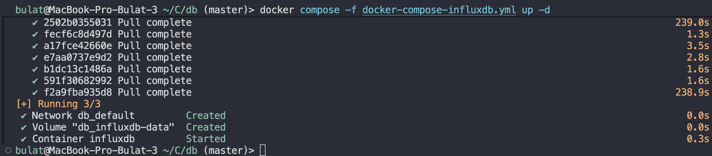

2. Создание базы через веб-интерфейс

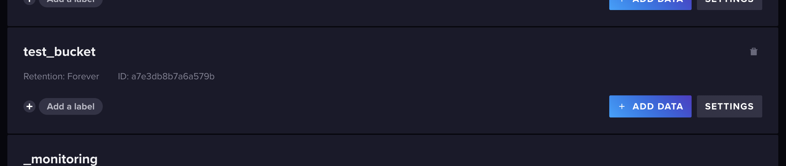

3. Наполнение данными (промышленных ) датчиков:

Вставлял add data -> в блоке Client Libraries / Line Protocol выбрать или найти пункт Line Protocol

```
	current,motor_id=M-1001,type=induction,load=high value=151.2
	current,motor_id=M-1001,type=induction,load=high value=162.8
	current,motor_id=M-1002,type=servo,load=medium value=88.3
	current,motor_id=M-1002,type=servo,load=medium value=91.7
	current,motor_id=M-1003,type=induction,load=low value=54.9
	current,motor_id=M-1003,type=induction,load=low value=58.4
	pressure,pipe_id=MP-01,section=main,zone=A value=4.2
	pressure,pipe_id=MP-01,section=main,zone=A value=4.8
	pressure,pipe_id=MP-01,section=main,zone=A value=5.4
	pressure,pipe_id=MP-02,section=backup,zone=B value=3.1
	pressure,pipe_id=MP-02,section=backup,zone=B value=3.6
	pressure,pipe_id=MP-03,section=main,zone=C value=6.2
	pressure,pipe_id=MP-03,section=main,zone=C value=6.8
	temperature,sensor_id=T-01,zone=A,equipment=motor value=72.4
	temperature,sensor_id=T-01,zone=A,equipment=motor value=78.1
	temperature,sensor_id=T-02,zone=B,equipment=pipeline value=41.5
	temperature,sensor_id=T-02,zone=B,equipment=pipeline value=45.9
	current,motor_id=M-1001,type=induction,load=high value=155.1
	current,motor_id=M-1001,type=induction,load=high value=160.4
```

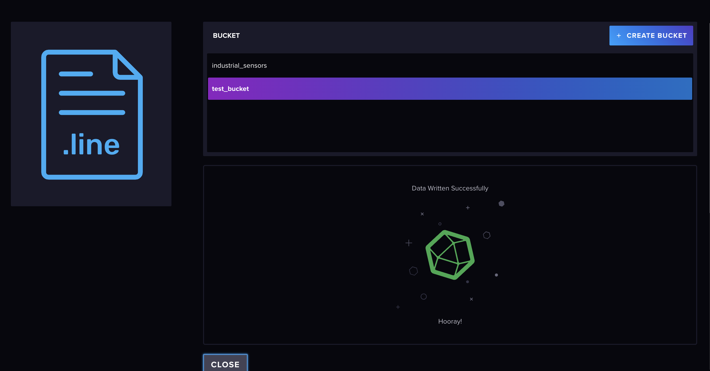

4. Базовые запросы: Просмотреть все данные за последние 30 минут, посмотреть измерения только 1 датчика,
   максимальное значение на 1 датчике, среднее значение на датчике, 2-3 аналитических запроса с фильтром
   по значению, запрос на агрегацию данных.

### Просмотреть все данные за последние 30 минут

```
	from(bucket: "test_bucket")
  	|> range(start: -30m)
```


### Посмотреть измерения только одного датчика M-1001

```
  from(bucket: "test_bucket")
    |> range(start: -30m)
    |> filter(fn: (r) => r._measurement == "current")
    |> filter(fn: (r) => r.motor_id == "M-1001")
```

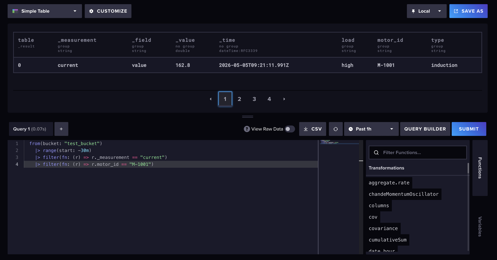

### Максимальное значение на одном датчике M-1001

```
	from(bucket: "test_bucket")
  	|> range(start: -30m)
  	|> filter(fn: (r) => r._measurement == "current")
  	|> filter(fn: (r) => r.motor_id == "M-1001")
  	|> max()
```

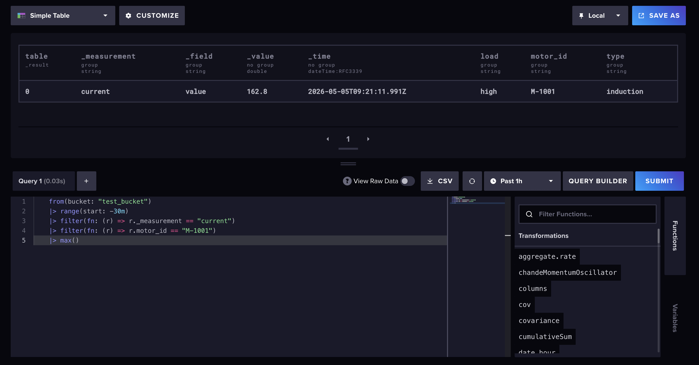

### Среднее значение на датчике M-1001

```
  from(bucket: "test_bucket")
    |> range(start: -30m)
    |> filter(fn: (r) => r._measurement == "current")
    |> filter(fn: (r) => r.motor_id == "M-1001")
    |> mean()
```


### Аналитический запрос 1. Двигатели с током выше 140

```
  from(bucket: "test_bucket")
    |> range(start: -30m)
    |> filter(fn: (r) => r._measurement == "current")
    |> filter(fn: (r) => r._value > 140.0)
```

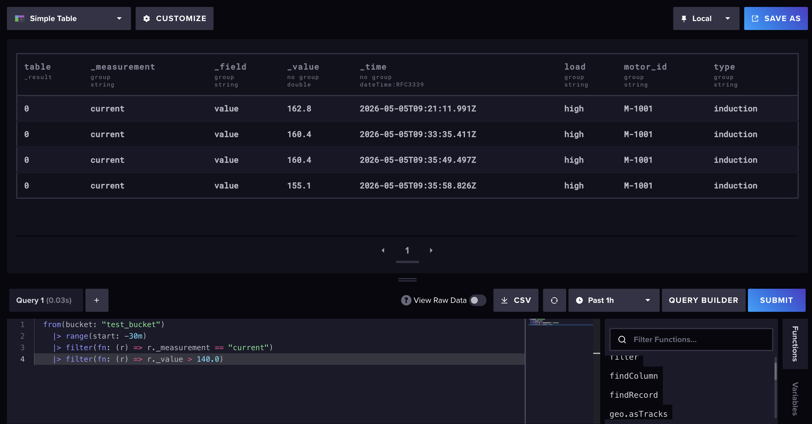

### Аналитический запрос 2. Давление в основной секции выше 5

```
	from(bucket: "test_bucket")
    |> range(start: -30m)
    |> filter(fn: (r) => r._measurement == "pressure")
    |> filter(fn: (r) => r.section == "main")
    |> filter(fn: (r) => r._value > 5.0)
```

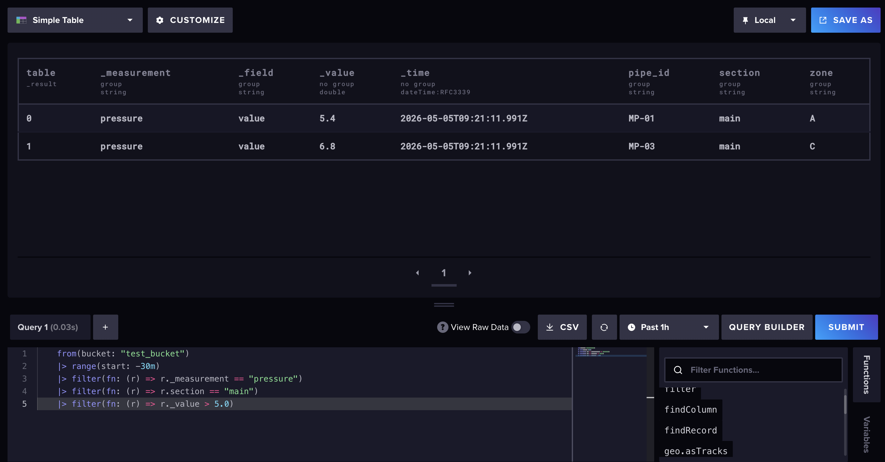

### Аналитический запрос 3. Температура в зоне A выше 75

```
  from(bucket: "test_bucket")
    |> range(start: -30m)
    |> filter(fn: (r) => r._measurement == "temperature")
    |> filter(fn: (r) => r.zone == "A")
    |> filter(fn: (r) => r._value > 75.0)
```

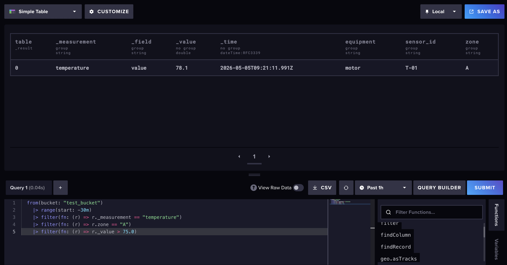

### Среднее значение по каждому measurement за последние 30 минут:

```
	from(bucket: "test_bucket")
  	|> range(start: -30m)
  	|> group(columns: ["_measurement"])
  	|> mean()
```

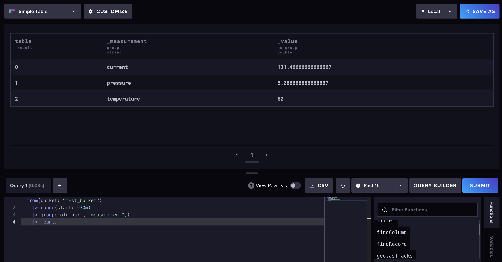

5. Создайте Dashboard с 1-2 графиками

```
	 from(bucket: "test_bucket")
   |> range(start: -30m)
   |> filter(fn: (r) => r._measurement == "current")
   |> aggregateWindow(every: 1m, fn: mean, createEmpty: false)
```

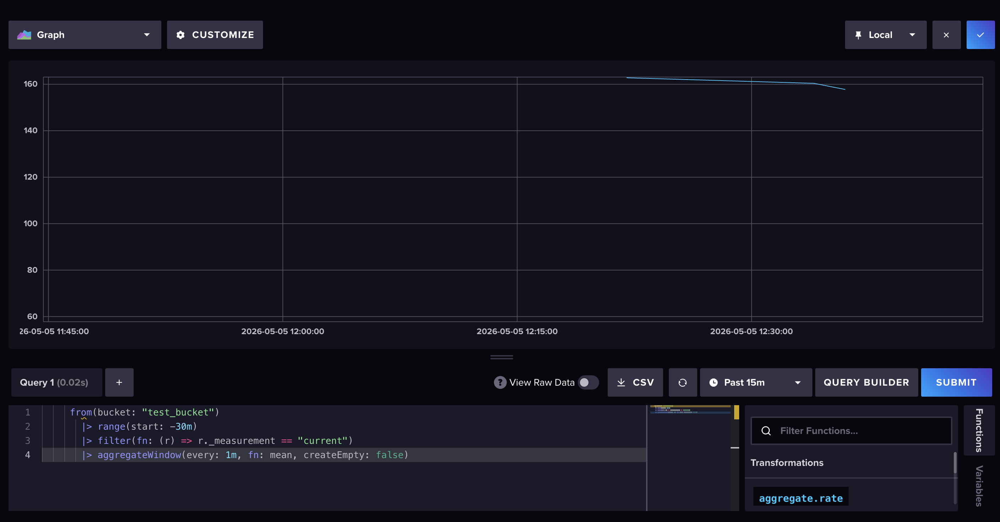
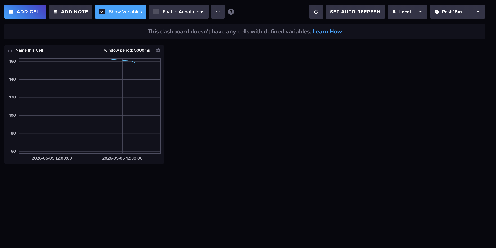
