# Домашнее задание — MongoDB

## Задание

- Поднять в docker compose mongoDB

```bash
	docker compose -f docker-compose-mongodb.yml up -d
	docker exec -it mongodb mongosh -u root -p root

	use hwdb
```

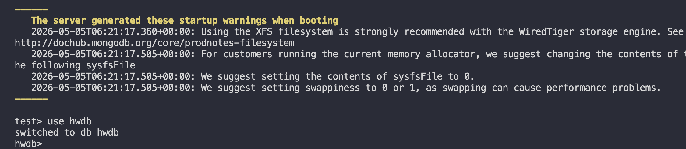

- Создать минимум 3 коллекции, хотя бы 2 из которых связаны `ObjectId`, хотя бы 1 из документов в коллекции хранят JSON объекты либо массивы

```bash
	db.createCollection("students")
	db.createCollection("courses")
	db.createCollection("enrollments")
```

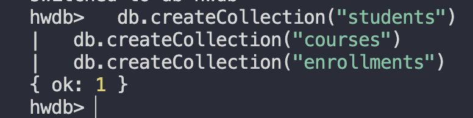

```bash
	const ivanId = new ObjectId()
	const annaId = new ObjectId()
	const petrId = new ObjectId()
	const dbCourseId = new ObjectId()
	const mongoCourseId = new ObjectId()
	const redisCourseId = new ObjectId()
```

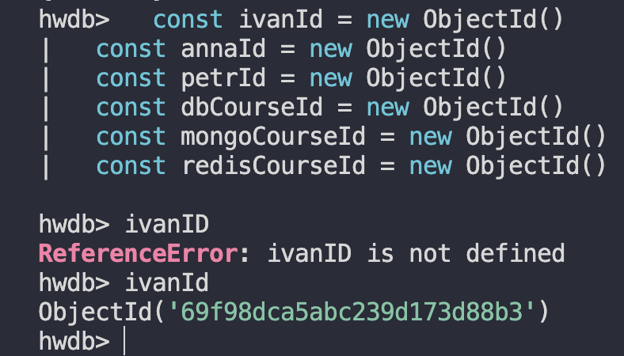

- Наполнить каждую коллекцию необходимым количеством данных

```bash
	db.students.insertMany([
  {
    _id: ivanId,
    name: "Ivan",
    group: "DB-101",
    gpa: 4.6,
    contacts: { email: "ivan@example.com", city: "Moscow" },
    skills: ["SQL", "MongoDB"]
  },
  {
    _id: annaId,
    name: "Anna",
    group: "DB-101",
    gpa: 4.2,
    contacts: { email: "anna@example.com", city: "Kazan" },
    skills: ["Python", "Redis"]
  },
  {
    _id: petrId,
    name: "Petr",
    group: "DB-102",
    gpa: 4.9,
    contacts: { email: "petr@example.com", city: "Sochi" },
    skills: ["PostgreSQL", "Docker"]
  }
])
```

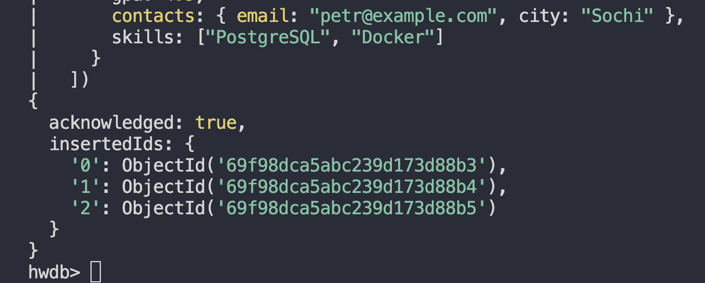

```bash
	db.courses.insertMany([
    {
      _id: dbCourseId,
      title: "Database Basics",
      teacher: { name: "Dr. Smith", email: "smith@example.com" },
      topics: ["relations", "indexes", "transactions"]
    },
    {
      _id: mongoCourseId,
      title: "MongoDB",
      teacher: { name: "Dr. Brown", email: "brown@example.com" },
      topics: ["documents", "ObjectId", "aggregation"]
    },
    {
      _id: redisCourseId,
      title: "Redis",
      teacher: { name: "Dr. Green", email: "green@example.com" },
      topics: ["hash", "sorted set", "ttl"]
    }
  ])
```

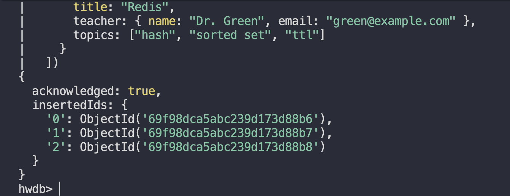

```bash
	  db.enrollments.insertMany([
    { studentId: ivanId, courseId: dbCourseId, grade: 5, status: "completed" },
    { studentId: ivanId, courseId: mongoCourseId, grade: 4, status: "active" },
    { studentId: annaId, courseId: mongoCourseId, grade: 5, status: "active" },
    { studentId: annaId, courseId: redisCourseId, grade: 4, status: "active" },
    { studentId: petrId, courseId: dbCourseId, grade: 5, status: "completed" },
    { studentId: petrId, courseId: redisCourseId, grade: 5, status: "active" }
  ])
```

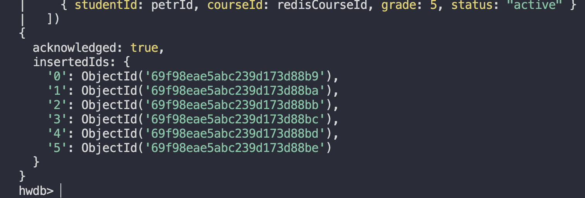

- Написать 2 `find` запроса, хотя бы 1 с projection (`{ field1: 0, field2: 1 }`)

### Найти студентов с GPA выше 4.5:

```bash
	db.students.find({ gpa: { $gt: 4.5 } })
```

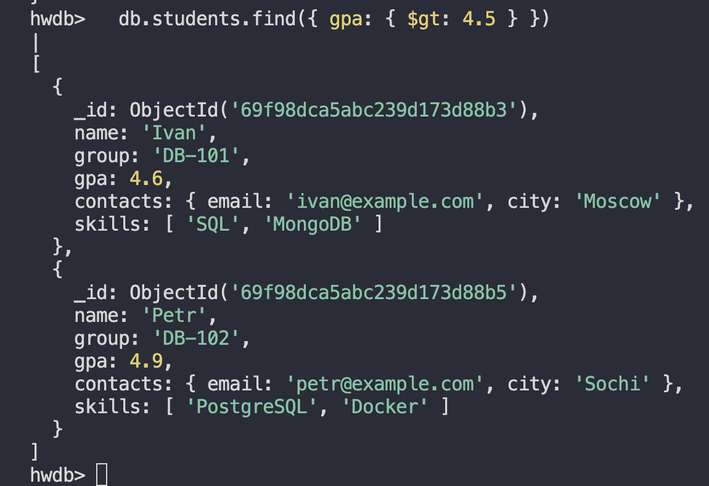

### Найти студентов группы DB-101 с projection (показываем name, group, gpa и скрываем \_id):

```bash
	db.students.find(
  	{ group: "DB-101" },
  	{ _id: 0, name: 1, group: 1, gpa: 1 }
	)
```

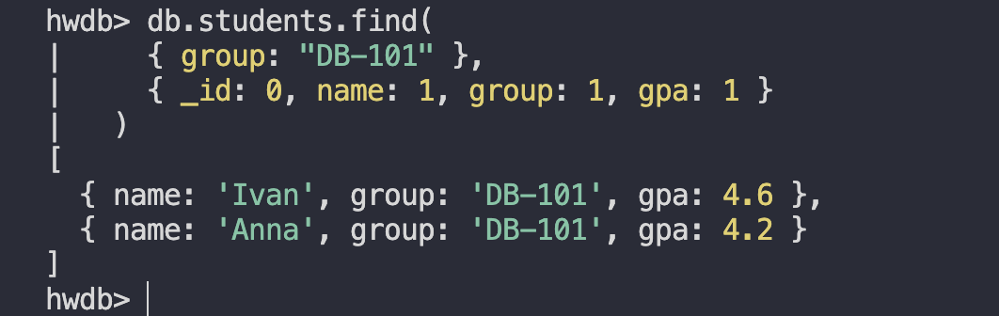

- Написать 2 `update` запроса

### Обновить GPA студента Ivan:

```bash
	db.students.updateOne(
  	{ name: "Ivan" },
  	{ $set: { gpa: 4.8 } }
	)

	db.students.findOne({name: "Ivan"})
```

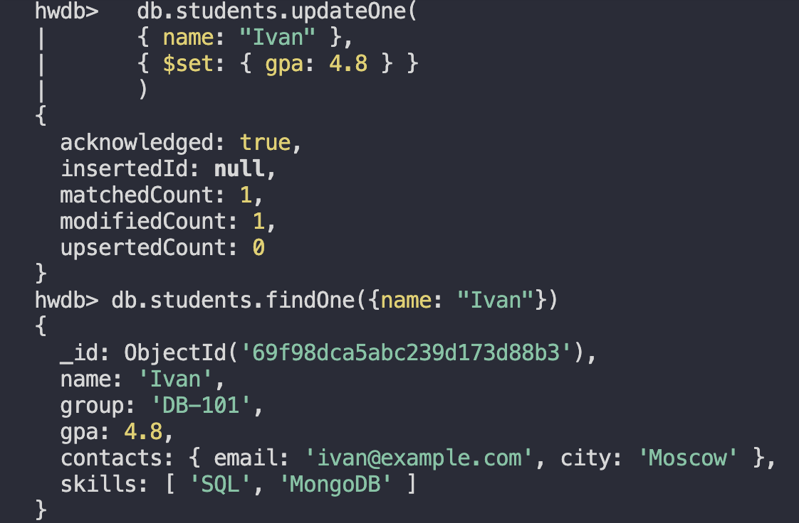

```bash
	db.students.updateMany(
    { group: "DB-101" },
    { $addToSet: { skills: "Databases" } }
  )
```

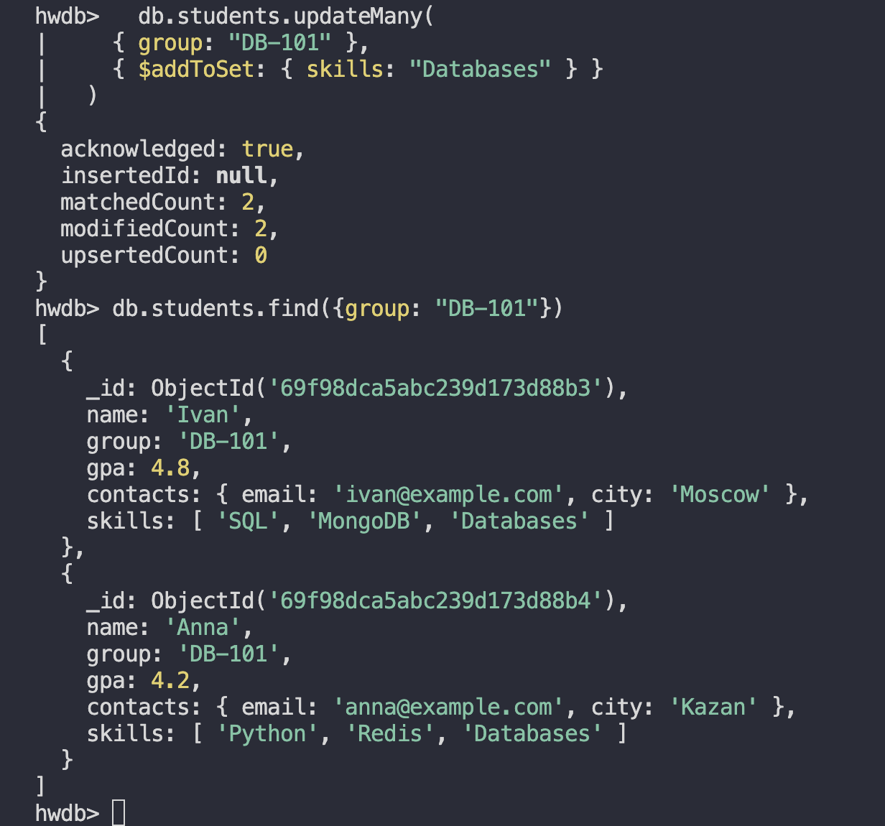

- Написать 1 любой запрос с `aggregate`

### Получить список записей на курсы вместе с именем студента и названием курса:

```bash
	db.enrollments.aggregate([
    {
      $lookup: {
        from: "students",
        localField: "studentId",
        foreignField: "_id",
        as: "student"
      }
    },
    { $unwind: "$student" },
    {
      $lookup: {
        from: "courses",
        localField: "courseId",
        foreignField: "_id",
        as: "course"
      }
    },
    { $unwind: "$course" },
    {
      $project: {
        _id: 0,
        studentName: "$student.name",
        courseTitle: "$course.title",
        grade: 1,
        status: 1
      }
    }
  ])
```

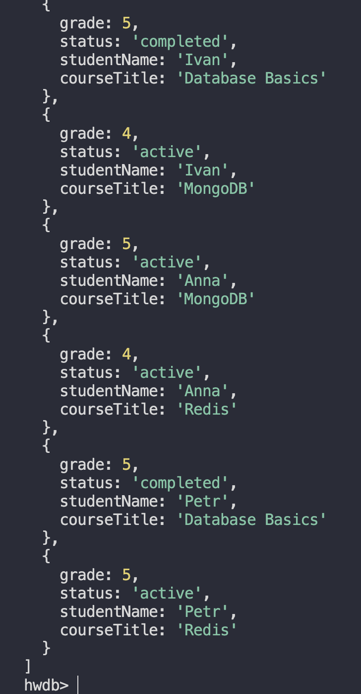
