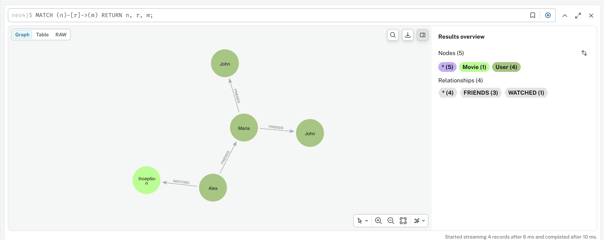
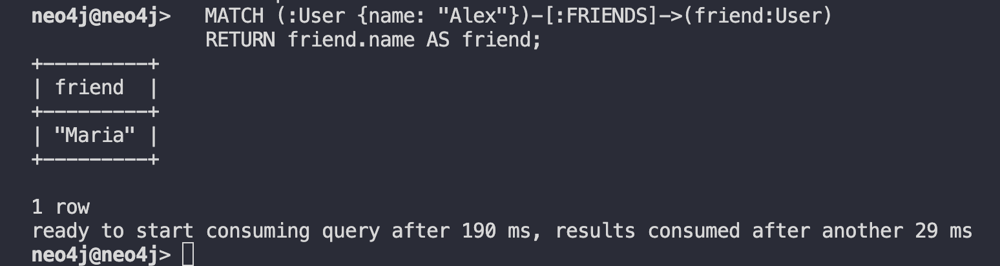
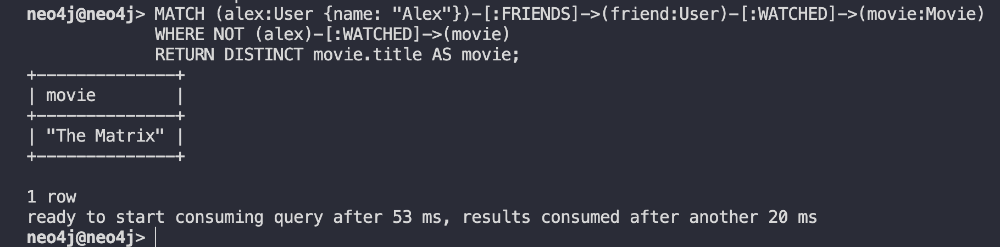
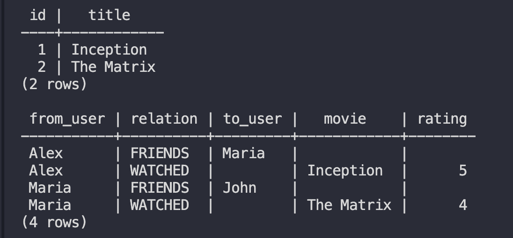
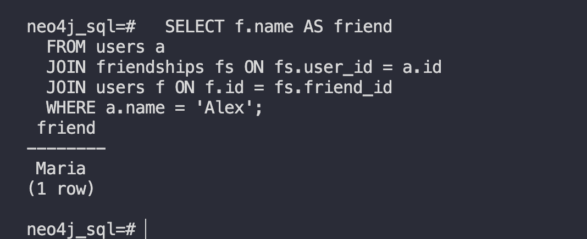
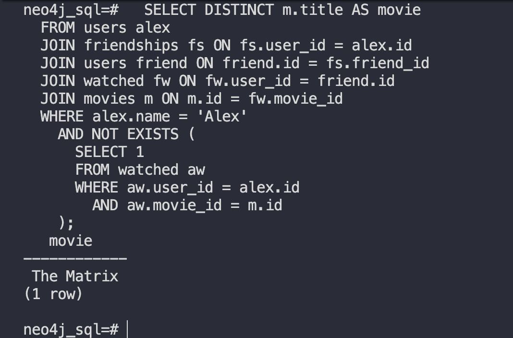

Задать структуру:

```bash
CREATE (alex:User {name: "Alex"}),
       (maria:User {name: "Maria"}),
       (john:User {name: "John"})
			 (john:User {name: "John"})

CREATE (inception:Movie {title: "Inception"}),
       (matrix:Movie {title: "The Matrix"})

MATCH (a:User {name: "Alex"}), (m:User {name: "Maria"})
CREATE (a)-[:FRIENDS]->(m)

MATCH (m:User {name: "Maria"}), (j:User {name: "John"})
CREATE (m)-[:FRIENDS]->(j)

MATCH (a:User {name: "Alex"}), (i:Movie {title: "Inception"})
CREATE (a)-[:WATCHED {rating: 5}]->(i)
```



Выполнить запросы:

- Найти всех друзей Алекса

```bash
	MATCH (:User {name: "Alex"})-[:FRIENDS]->(friend:User)
  RETURN friend.name AS friend
```



- Найти фильмы, которые смотрели друзья Алекса, но не смотрел сам Алекс

```bash
	--- ТАК КАК НЕ БЫЛО НИ ОДНОГО ПРОСМОТРА У МАРИИ ---
	MATCH (m:User {name: "Maria"}), (matrix:Movie {title: "The Matrix"})
	CREATE (m)-[:WATCHED {rating: 4}]->(matrix)

	MATCH (alex:User {name: "Alex"})-[:FRIENDS]->(friend:User)-[:WATCHED]->(movie:Movie)
	WHERE NOT (alex)-[:WATCHED]->(movie)
	RETURN DISTINCT movie.title AS movie
```



Сравнить:

```sql
	INSERT INTO users (name)
  VALUES ('Alex'), ('Maria'), ('John');

  INSERT INTO movies (title)
  VALUES ('Inception'), ('The Matrix');

  INSERT INTO friendships (user_id, friend_id)
  SELECT u.id, f.id
  FROM users u
  JOIN users f ON f.name = 'Maria'
  WHERE u.name = 'Alex';

  INSERT INTO friendships (user_id, friend_id)
  SELECT u.id, f.id
  FROM users u
  JOIN users f ON f.name = 'John'
  WHERE u.name = 'Maria';

  INSERT INTO watched (user_id, movie_id, rating)
  SELECT u.id, m.id, 5
  FROM users u
  JOIN movies m ON m.title = 'Inception'
  WHERE u.name = 'Alex';

  INSERT INTO watched (user_id, movie_id, rating)
  SELECT u.id, m.id, 4
  FROM users u
  JOIN movies m ON m.title = 'The Matrix'
  WHERE u.name = 'Maria';
```



- Написать аналогичный запрос на SQL

```sql
  SELECT f.name AS friend
  FROM users a
  JOIN friendships fs ON fs.user_id = a.id
  JOIN users f ON f.id = fs.friend_id
  WHERE a.name = 'Alex';
```



```sql
  SELECT DISTINCT m.title AS movie
  FROM users alex
  JOIN friendships fs ON fs.user_id = alex.id
  JOIN users friend ON friend.id = fs.friend_id
  JOIN watched fw ON fw.user_id = friend.id
  JOIN movies m ON m.id = fw.movie_id
  WHERE alex.name = 'Alex'
    AND NOT EXISTS (
      SELECT 1
      FROM watched aw
      WHERE aw.user_id = alex.id
        AND aw.movie_id = m.id
  	);
```



- Сравнить сложность запросов

В Neo4j связи уже являются частью графа, поэтому не нужно вручную соединять много таблиц
В SQL то же самое получается длиннее. Нужно отдельно хранить пользователей, фильмы, дружбу и просмотры, а потом соединять их через JOIN. Из-за этого запрос выглядит сложнее: мы не просто “идем по связям”, а каждый раз объясняем базе, через какие таблицы эти связи собрать
