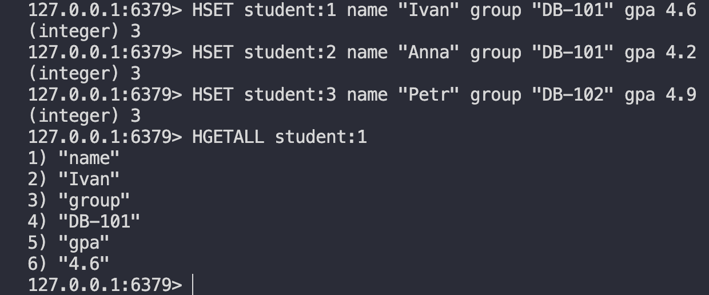
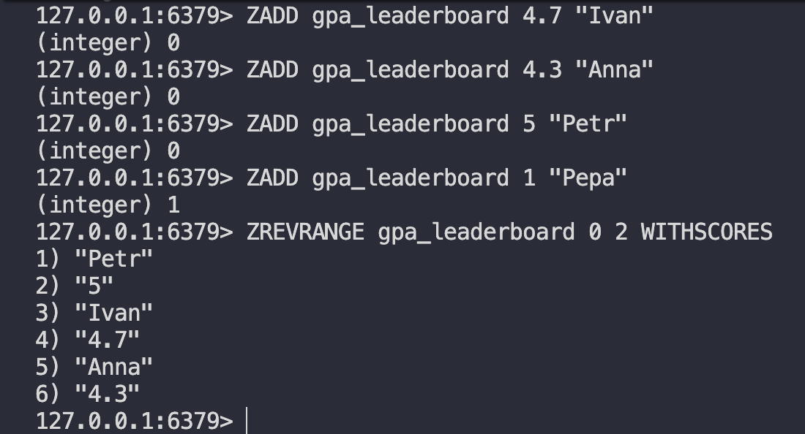
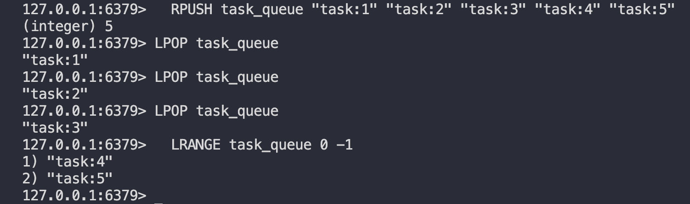
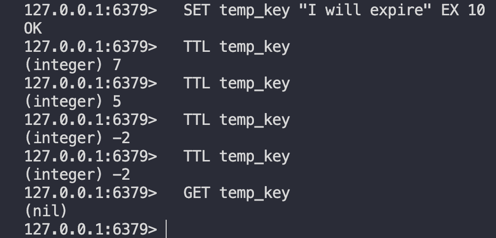
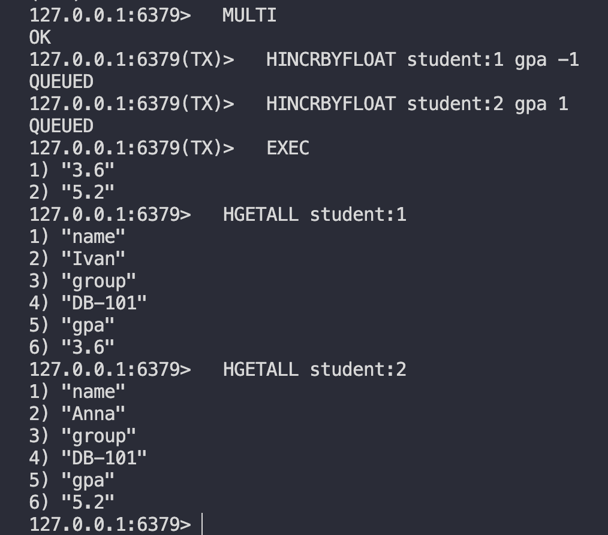
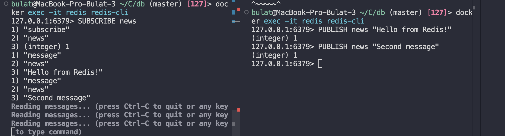

# Redis / Valkey — Домашнее задание

---

## Задание 1. Hash — данные о студентах

Создайте 3 студентов, используя Hash. Каждый ключ — `student:<id>`, поля: `name`, `group`, `gpa`.
Проверьте, что данные записались

```bash
  HSET student:1 name "Ivan" group "DB-101" gpa 4.6
  HSET student:2 name "Anna" group "DB-101" gpa 4.2
  HSET student:3 name "Petr" group "DB-102" gpa 4.9

  HGETALL student:1
```



---

## Задание 2. Sorted Set — лидерборд по GPA

Создайте рейтинг студентов по среднему баллу. В Sorted Set score = GPA, member = имя.
Выведите топ-3 по убыванию GPA:

```bash
  ZADD gpa_leaderboard 4.7 "Ivan"
  ZADD gpa_leaderboard 4.3 "Anna"
  ZADD gpa_leaderboard 5 "Petr"
  ZADD gpa_leaderboard 1 "Pepa"

  ZREVRANGE gpa_leaderboard 0 2 WITHSCORES
```



---

## Задание 3. List — очередь задач

Добавьте 5 задач в очередь через `RPUSH`:
Заберите 3 задачи из очереди (FIFO — первый вошёл, первый вышел):

```bash
  RPUSH task_queue "task:1" "task:2" "task:3" "task:4" "task:5"

  LPOP task_queue
  LPOP task_queue
  LPOP task_queue

  LRANGE task_queue 0 -1
```



---

## Задание 4. TTL — время жизни ключа

Создайте ключ с TTL 10 секунд:
Сразу проверьте оставшееся время:
Подождите и попробуйте получить значение:

```bash
  SET temp_key "I will expire" EX 10
  TTL temp_key

  --- cпустя 10 секунд ---
  TTL temp_key # -2, так как ключа нет
  GET temp_key
```



## Задание 5. Транзакция MULTI/EXEC

Смоделируйте «перевод» 1 балла GPA от студента 1 к студенту 2.

```
  MULTI
  HINCRBYFLOAT student:1 gpa -1
  HINCRBYFLOAT student:2 gpa 1
  EXEC

  HGETALL student:1
  HGETALL student:2
```



## Задание 6 (бонус). Pub/Sub

Откройте **два** терминала с `redis-cli`.

**Терминал 1** — подписчик:

```bash
  docker exec -it redis redis-cli

  SUBSCRIBE news
```

**Терминал 2** — издатель:

```bash
  docker exec -it redis redis-cli

  PUBLISH news "Hello from Redis!"
  PUBLISH news "Second message"
```


