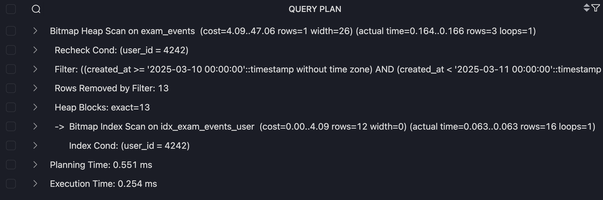
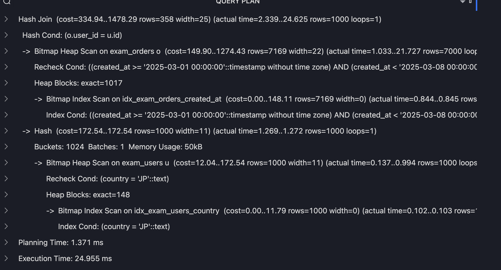
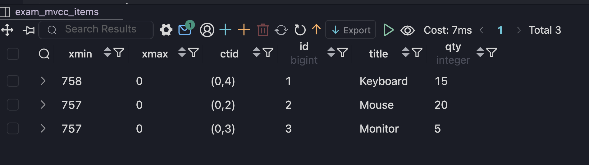
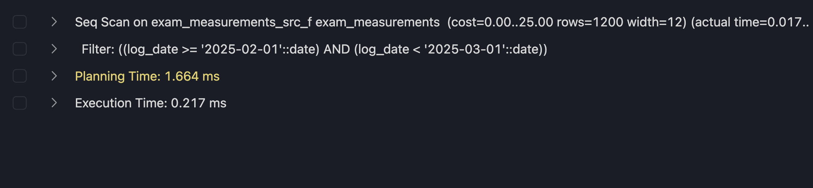

# Задание 1

```
ANALYSE exam_events;

EXPLAIN ANALYSE
SELECT id, user_id, amount, created_at
FROM exam_events
WHERE user_id = 4242
  AND created_at >= TIMESTAMP '2025-03-10 00:00:00'
  AND created_at < TIMESTAMP '2025-03-11 00:00:00';
```

## 1. Постройте план выполнения запроса до изменений


Я использовал EXPLAIN ANALYSE для пересчета и планирования выполнения запроса, а ANALYSE exam_events для пересчета выполнения после изменения таблиц

cost был равен 1617 и средний размер строк 26, в итоге вернул 3 строки, пройдя один раз, отфильтровал 60001

## 2. Укажите:

Использовался seq scan так как нет никаких индексов, которые оптимизировали бы данный запрос, мы не использовали amount, status, следовательно проходимся по всем строкам

Ни один не помог, так как в запросе они не используются

Он выбрал seq scan потому что другие выбрать он не мог

## 3. Индекс

CREATE INDEX idx_exam_events_user ON exam_events USING hash (user_id);

так как лучше всего создать индекс по hash у users, мы сразу кучу строк отбрасываем и скорость по hash в данном случае будет максимальна

## 4. Заново



проанализировать можно как выше

## 5. Объяснение

Так как у нас был индекс, мы сразу пошли по индексу, нашли все строки их 16, отфильтровали и вернули тот же результат, но с лучшей возможной скоростью

## 6. Ответьте, нужно ли после создания индекса выполнять ANALYZE, и зачем.

Нужно так как PostgreSQL пересчитает свой план выполнения и выберет лучший путь, но он может ошибиться

# Задание 1.

## 1. Постройте план выполнения запроса до изменений


## 2. Определите, какой тип JOIN использован.

Был использован hash join

## 3. Объясните, почему планировщик выбрал именно этот тип JOIN.

так как одна таблица намного меньше другой и выгоднее создать hash для маленькой и обращаться по hash во второй

## 4. Укажите, какие существующие индексы полезны слабо или не полезны для этого запроса.

CREATE INDEX idx_exam_users_name ON exam_users (name); - мы не пользовались

## 5. Предложите и создайте одно улучшение, которое может ускорить запрос.

CREATE INDEX idx_exam_users_country ON exam_users (country);

## 6. Повторно постройте план выполнения.



## 7. Кратко поясните, улучшился ли план и за счет чего.

Мы сначала фильтруем по where стране по индексу, а потом только join делаем, это дает максимальную скорость

cost стал лучше

## 8. Отдельно укажите, что означает преобладание shared hit или read в BUFFERS.

hit из кэша, а read из диска если данных слишком много и они в hash не помещаются

# Задание 3

## 1. Опишите, что изменилось после UPDATE с точки зрения xmin, xmax и ctid.





xmin - изменился, xmax - означает что данные изменились, ctid - новое расположение данных в байтах

## 2. Объясните, почему в модели MVCC UPDATE не является простым "перезаписыванием" строки.

после update данная строка становится мертвым, его xmax помечается транзакцией которая изменила, и xmin новый уже (новая страка) является ссылкой на измененную транзакци.

## 3. Объясните, что произошло после DELETE и почему строка исчезла из обычного SELECT.

его xmax изменился, пометился как мертвый и autovacuum очистил данную строку

## 4. Кратко сравните:

VACUUM - очищает без блокирования, чистит мертвые кортежи но размер файла не изменяется
autovacuum - очистил в фоне, без вызова, сам
VACUUM FULL - очищает с блокированием

## 5. Отдельно укажите, какой из этих механизмов может полностью блокировать таблицу.

VACUUM FULL - блокирует полностью

# Задание 5. Секционирование и partition pruning

## 1. Таблица должна быть секционирована по RANGE по полю log_date.

```sql
CREATE TABLE exam_measurements (
    city_id INTEGER NOT NULL,
    log_date DATE NOT NULL,
    peaktemp INTEGER,
    unitsales INTEGER
) PARTITION by RANGE (log_date);

CREATE TABLE exam_measurements_src_j
PARTITION OF exam_measurements
FOR VALUES from ('2025-01-01') to ('2025-02-01');

CREATE TABLE exam_measurements_src_f
PARTITION OF exam_measurements
FOR VALUES from ('2025-02-01') to ('2025-03-01');

CREATE TABLE exam_measurements_src_m
PARTITION OF exam_measurements
FOR VALUES from ('2025-03-01') to ('2025-04-01');

CREATE TABLE exam_measurements_src_d
PARTITION OF exam_measurements DEFAULT;
```

```sql
INSERT INTO exam_measurements (city_id, log_date, peaktemp, unitsales)
SELECT
    (g % 50) + 1,
    DATE '2025-01-01' + (g % 31),
    (g % 25) - 5,
    50 + (g % 300)
FROM generate_series(1, 1200) AS g;

INSERT INTO exam_measurements (city_id, log_date, peaktemp, unitsales)
SELECT
    (g % 50) + 1,
    DATE '2025-02-01' + (g % 28),
    (g % 25),
    70 + (g % 320)
FROM generate_series(1, 1200) AS g;

INSERT INTO exam_measurements (city_id, log_date, peaktemp, unitsales)
SELECT
    (g % 50) + 1,
    DATE '2025-03-01' + (g % 31),
    5 + (g % 20),
    90 + (g % 350)
FROM generate_series(1, 1200) AS g;

INSERT INTO exam_measurements (city_id, log_date, peaktemp, unitsales)
SELECT
    (g % 50) + 1,
    DATE '2025-04-01' + (g % 10),
    10 + (g % 15),
    100 + (g % 200)
FROM generate_series(1, 100) AS g;
```

1. 
   есть partition pruning
   1 секция
   тут чисто по одному range

2. 
   есть partition pruning
   все секции 4
   тут нет range и он смотрит все

общие ответы
нет не связан
если range не подошел идет в default
