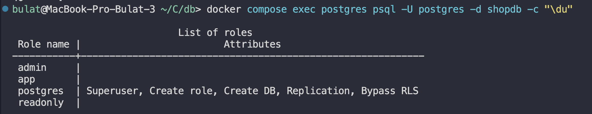
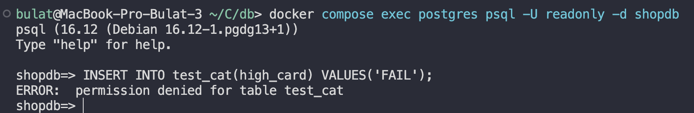
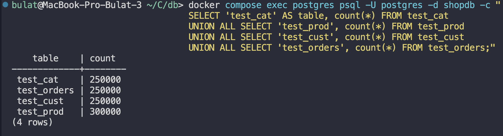

## Создание ролей и их успешность

Роли создались и их можем увидеть через \du



## Проверка ролей, а точнее readonly на ошибку вставки

Мы подключились к бд и попробовали вставку

```
docker compose exec postgres psql -U readonly -d shopdb
INSERT INTO test_cat(high_card) VALUES('FAIL');
```



## Количество строк в таблицах (новые вставленные)

```
docker compose exec postgres psql -U postgres -d shopdb -c "
SELECT 'test_cat' AS table, count(*) FROM test_cat
UNION ALL SELECT 'test_prod', count(*) FROM test_prod
UNION ALL SELECT 'test_cust', count(*) FROM test_cust
UNION ALL SELECT 'test_orders', count(*) FROM test_orders;"
```


