## =

```
	EXPLAIN (ANALYZE)
	SELECT * FROM test_prod WHERE high_card = 'PROD_150000';

	EXPLAIN (ANALYZE, BUFFERS)
	SELECT * FROM test_prod WHERE high_card = 'PROD_150000';
```

### без индексов

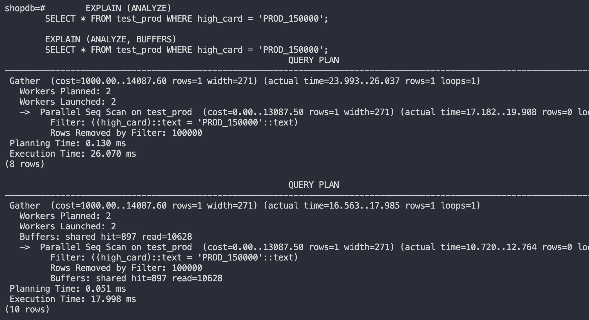

### с b-tree индексом

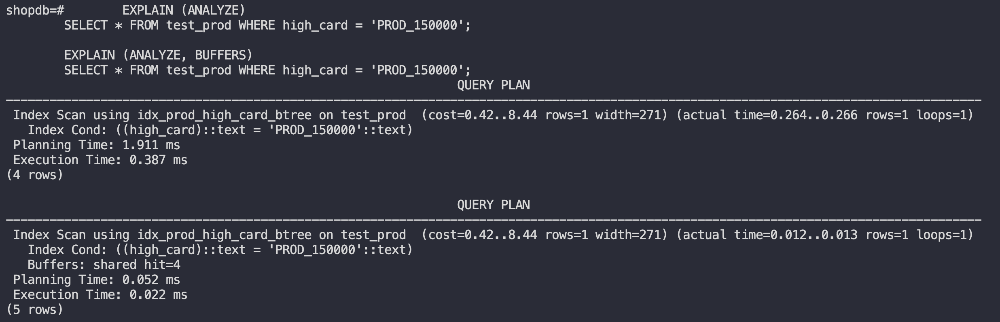

### с hash индексом

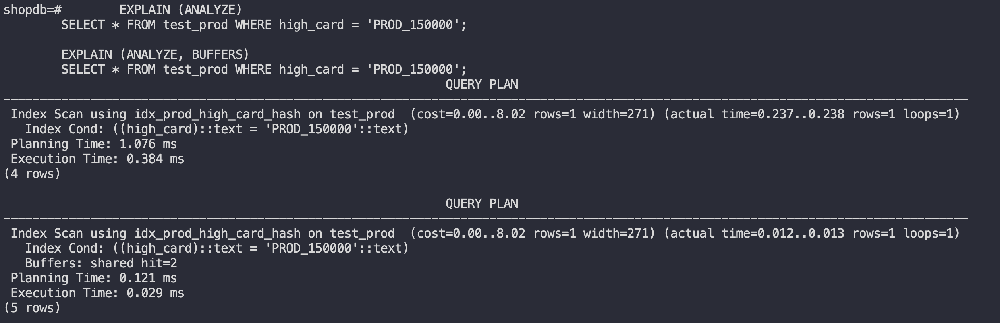

## >

```
	EXPLAIN (ANALYZE)
	SELECT * FROM test_prod WHERE num_range > 450;

	EXPLAIN (ANALYZE, BUFFERS)
	SELECT * FROM test_prod WHERE num_range > 450;
```

### без индексов

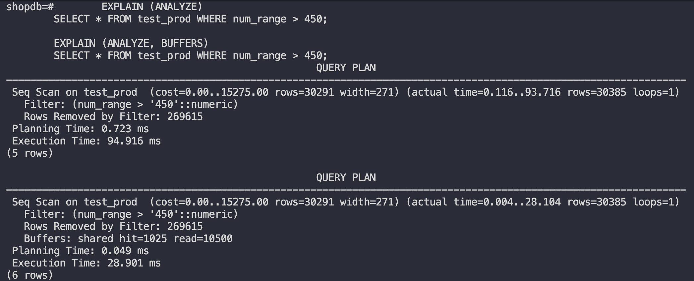

### с b-tree индексом

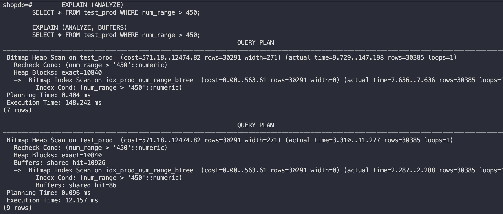

### с hash индексом

не поддерживает

## <

```
	EXPLAIN (ANALYZE)
	SELECT * FROM test_prod WHERE num_range < 50;

	EXPLAIN (ANALYZE, BUFFERS)
	SELECT * FROM test_prod WHERE num_range < 50;
```

### без индексов

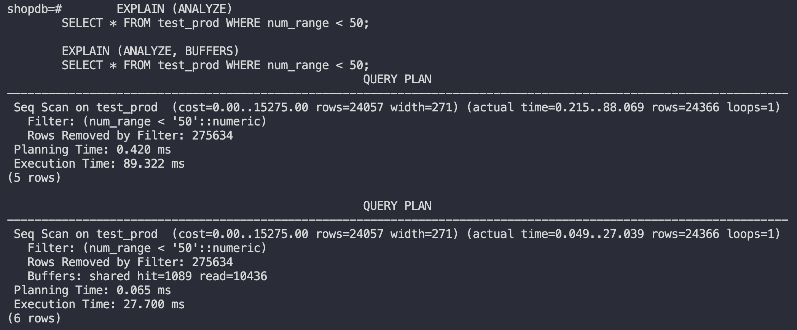

### с b-tree индексом

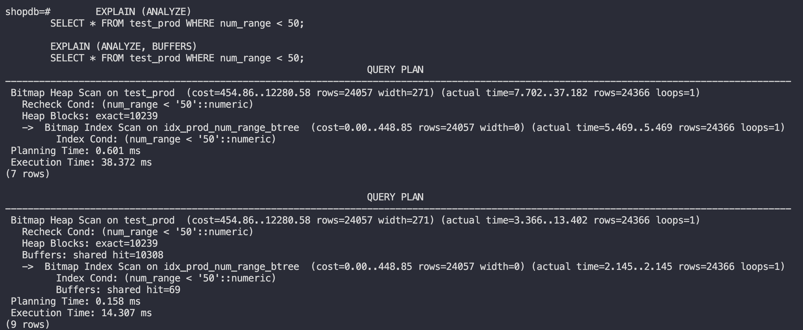

### с hash индексом

не поддерживает

## LIKE с суффиксом (%like)

```
	EXPLAIN (ANALYZE)
	SELECT * FROM test_prod WHERE low_card LIKE '%Y';

	EXPLAIN (ANALYZE, BUFFERS)
	SELECT * FROM test_prod WHERE low_card LIKE '%Y';
```

### без индексов

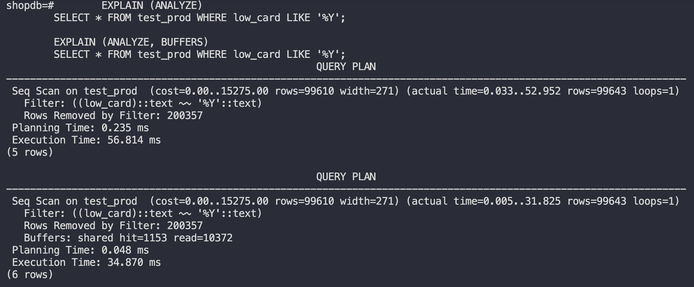

### с b-tree индексом

Не поддерживается b-tree индексом

### с hash индексом

Не поддерживается hash индексом

## LIKE с префиксом (like%)

```
	EXPLAIN (ANALYZE)
	SELECT * FROM test_prod WHERE high_card LIKE 'PROD_1%';

	EXPLAIN (ANALYZE, BUFFERS)
	SELECT * FROM test_prod WHERE high_card LIKE 'PROD_1%';
```

### без индексов

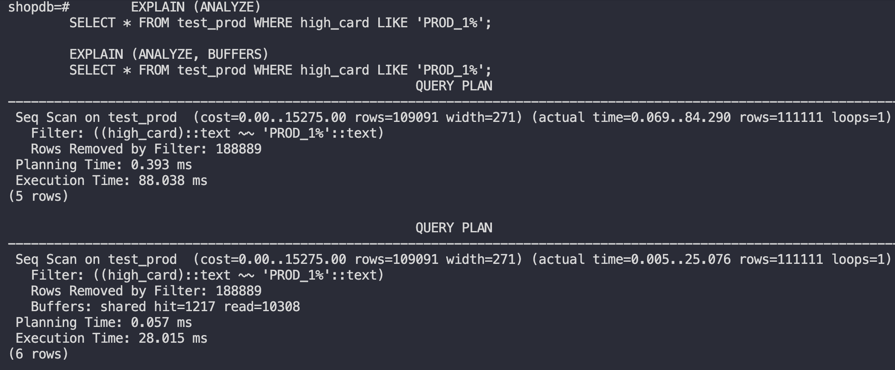

### с b-tree индексом (само выбрало не использовать индексы, связано с тем, что около 38% всех записей в бд, это то что мы ищем и это дольше, чем простой поиск)

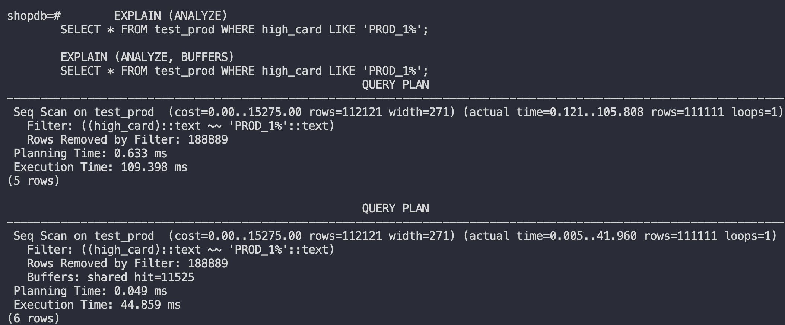

### с hash индексом

аналогично b-tree

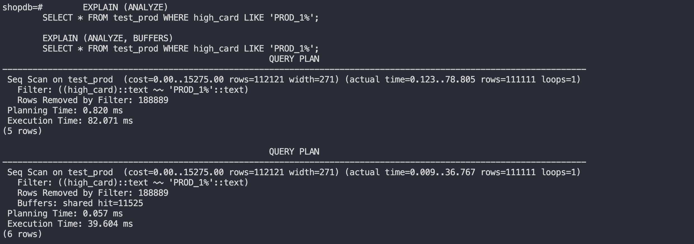

## IN (множественный поиск)

```
	EXPLAIN (ANALYZE)
	SELECT * FROM test_prod WHERE high_card IN ('PROD_150000', 'PROD_150001', 'PROD_150002');

	EXPLAIN (ANALYZE, BUFFERS)
	SELECT * FROM test_prod WHERE high_card IN ('PROD_150000', 'PROD_150001', 'PROD_150002');
```

### без индексов

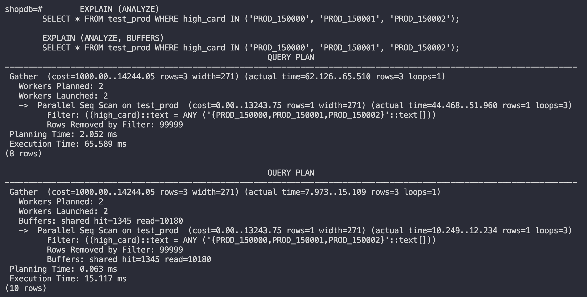

### с b-tree индексом

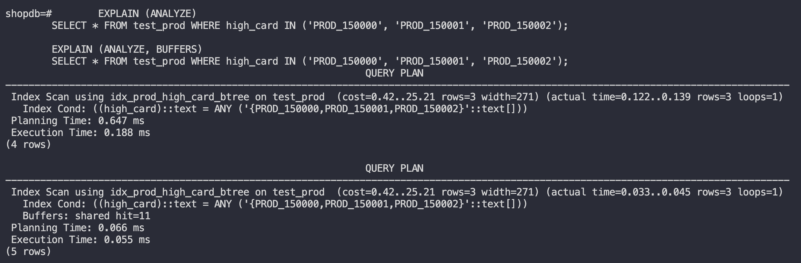

### с hash индексом

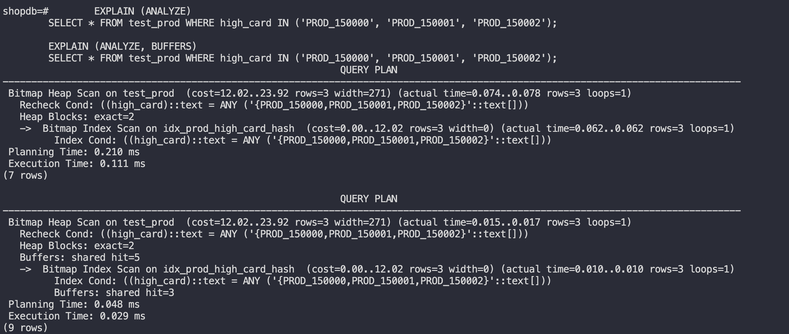

# Составной индекс

## без индекса

```
	EXPLAIN (ANALYZE, BUFFERS)
	SELECT * FROM test_prod WHERE low_card = 'X' AND num_range > 400;

	EXPLAIN (ANALYZE, BUFFERS)
	SELECT * FROM test_prod WHERE low_card = 'X' ORDER BY num_range LIMIT 10;

	EXPLAIN (ANALYZE, BUFFERS)
	SELECT * FROM test_prod WHERE low_card IN ('X', 'Y') AND num_range BETWEEN 100 AND 200;
```

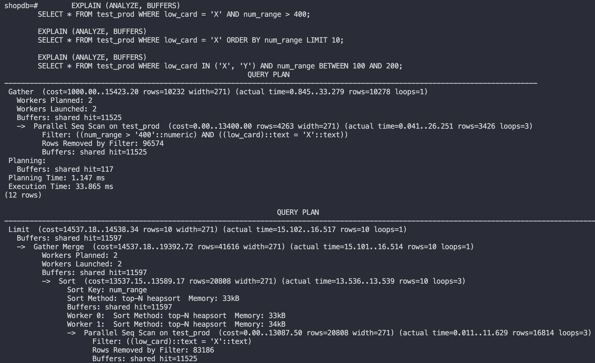
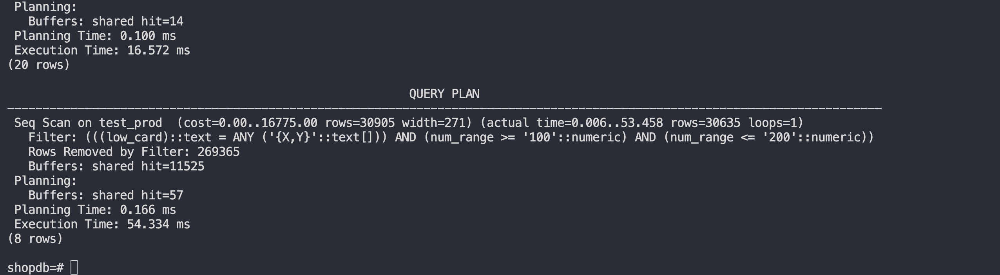

## с составным индексом

```
	CREATE INDEX idx_prod_composite1 ON test_prod(low_card, num_range);
	CREATE INDEX idx_prod_composite2 ON test_prod(num_range, low_card);
	CREATE INDEX idx_prod_composite3 ON test_prod(low_card) INCLUDE (num_range, high_card);
```

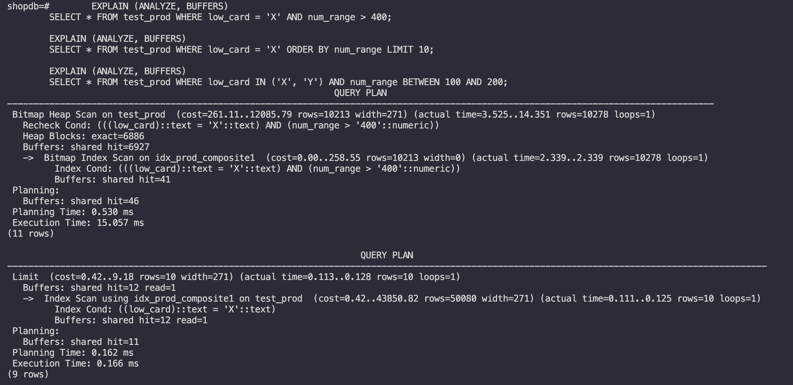
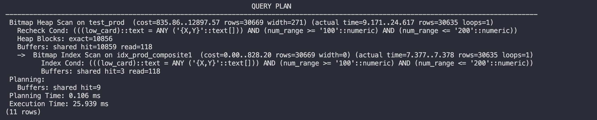
