## Создадим GIN индексы

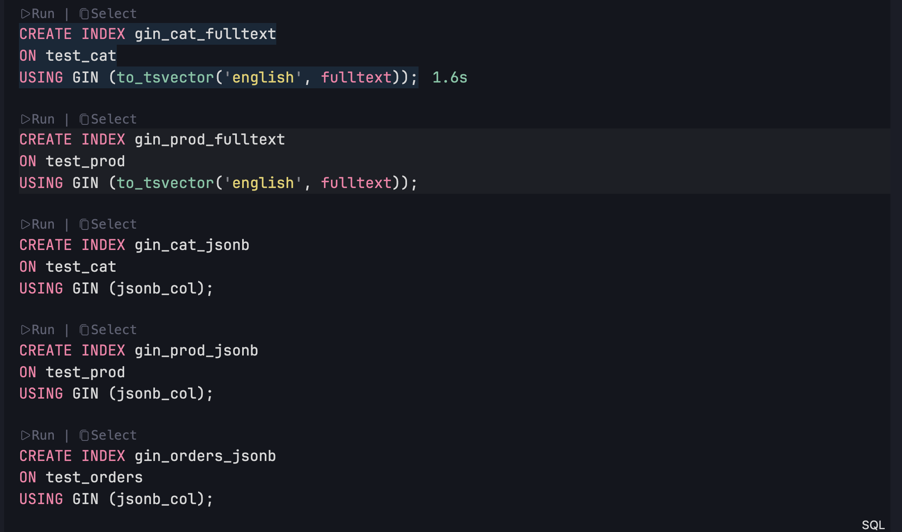

```
	EXPLAIN ANALYZE
	SELECT *
	FROM test_cat
	WHERE to_tsvector('english', fulltext)
	@@ to_tsquery('english','4cf60e8326c0d2dfe07e296133a39238');
```

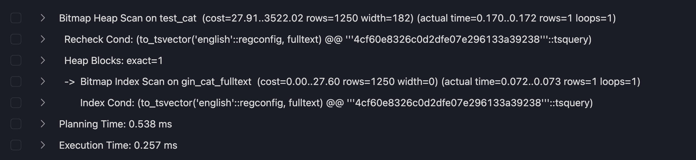

```
	EXPLAIN ANALYZE
	SELECT *
	FROM test_prod
	WHERE to_tsvector('english', fulltext)
	@@ to_tsquery('english','customer');
```

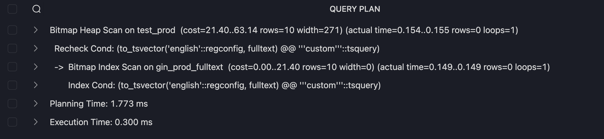

```
	EXPLAIN ANALYZE
	SELECT *
	FROM test_cat
	WHERE jsonb_col @> '{"id": 1000}';

```

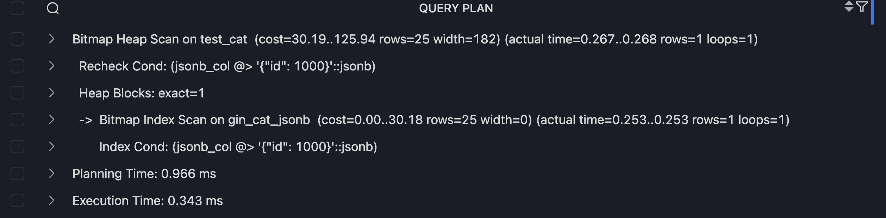

```
	ANALYSE test_prod;

	EXPLAIN ANALYZE
	SELECT *
	FROM test_prod
	WHERE jsonb_col ? 'type';
```

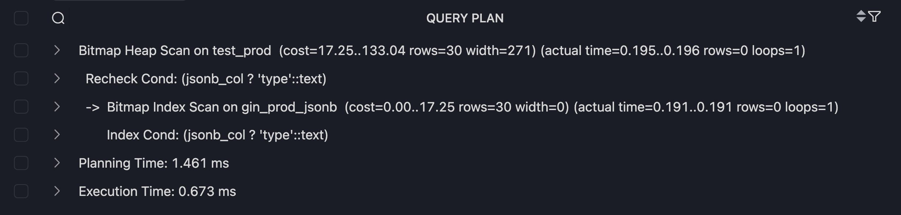

```
	EXPLAIN ANALYZE
	SELECT *
	FROM test_orders
	WHERE jsonb_col @> '{"promo": false}';
```

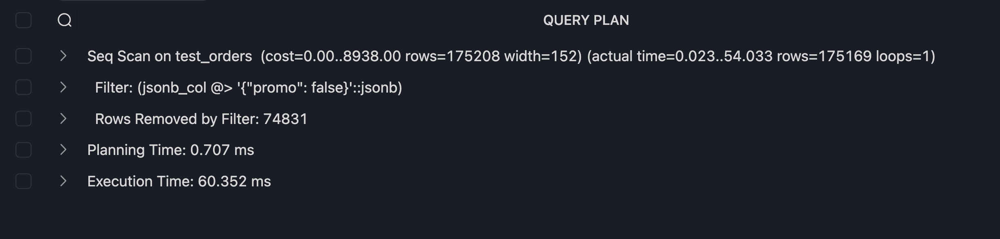

## Создадим Gist индексы

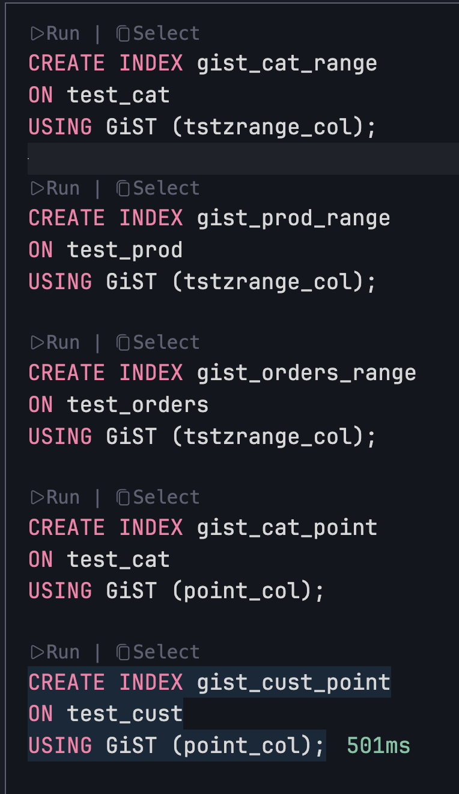

```
	EXPLAIN ANALYZE
	SELECT *
	FROM test_cat
	WHERE tstzrange_col @> now();
```

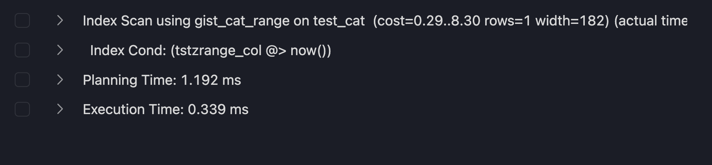

```
	EXPLAIN ANALYZE
	SELECT *
	FROM test_orders
	WHERE tstzrange_col && tstzrange(now()-interval '10 days', now());
```

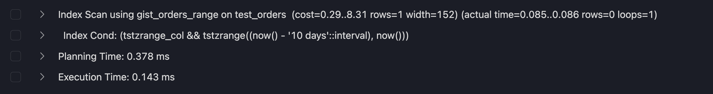

```
	EXPLAIN ANALYZE
	SELECT *
	FROM test_cat
	WHERE point_col <@ circle(point(0,0),50);
```

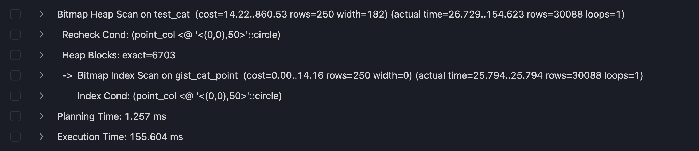

```
	EXPLAIN ANALYZE
	SELECT *
	FROM test_cust
	WHERE point_col <@ box(point(-50,-50), point(50,50));
```

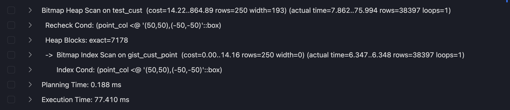

```
	EXPLAIN ANALYZE
	SELECT *
	FROM test_cust
	ORDER BY point_col <-> point(10,10)
	LIMIT 5;
```

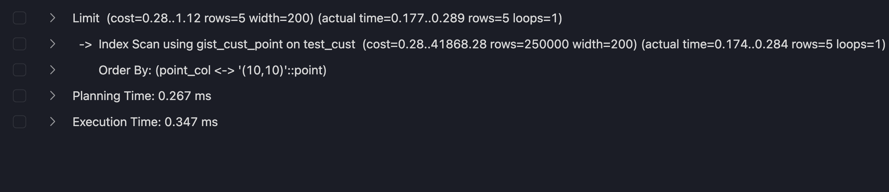

## JOIN

```
	EXPLAIN ANALYZE
	SELECT o.id, c.high_card, o.low_card
	FROM test_orders o
	JOIN test_cust c
	ON o.cust_id = c.id
	LIMIT 50;
```

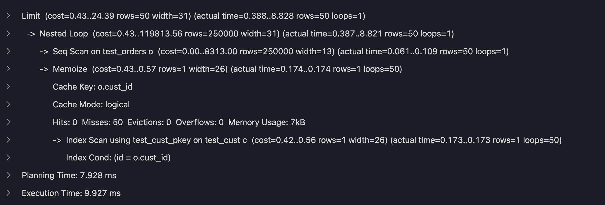

```
	EXPLAIN ANALYZE
	SELECT o.id, p.high_card, o.num_range
	FROM test_orders o
	JOIN test_prod p
	ON o.prod_id = p.id
```

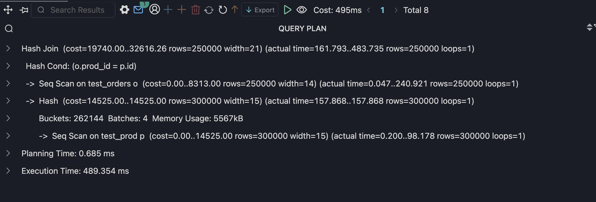

```
	EXPLAIN ANALYZE
	SELECT p.high_card, c.high_card
	FROM test_prod p
	JOIN test_cat c
	ON p.cat_id = c.id
	LIMIT 50;
```

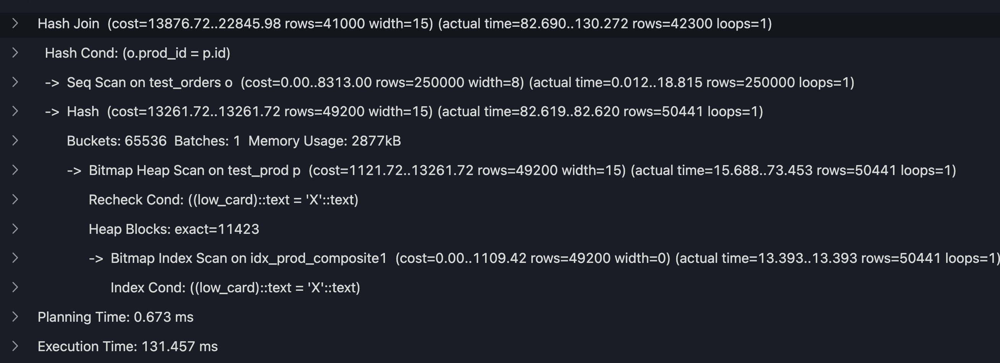

```
	EXPLAIN ANALYZE
	SELECT
	o.id,
	c.high_card AS customer,
	p.high_card AS product
	FROM test_orders o
	JOIN test_cust c ON o.cust_id = c.id
	JOIN test_prod p ON o.prod_id = p.id
	LIMIT 50;
```

```
Limit  (cost=0.86..50.16 rows=50 width=37) (actual time=0.748..4.187 rows=50 loops=1)
  ->  Nested Loop  (cost=0.86..246508.72 rows=250000 width=37) (actual time=0.747..4.179 rows=50 loops=1)
        ->  Nested Loop  (cost=0.43..119813.56 rows=250000 width=30) (actual time=0.664..3.354 rows=50 loops=1)
              ->  Seq Scan on test_orders o  (cost=0.00..8313.00 rows=250000 width=12) (actual time=0.026..0.049 rows=50 loops=1)
              ->  Memoize  (cost=0.43..0.57 rows=1 width=26) (actual time=0.065..0.065 rows=1 loops=50)
                    Cache Key: o.cust_id
                    Cache Mode: logical
                    Hits: 0  Misses: 50  Evictions: 0  Overflows: 0  Memory Usage: 7kB
                    ->  Index Scan using test_cust_pkey on test_cust c  (cost=0.42..0.56 rows=1 width=26) (actual time=0.064..0.064 rows=1 loops=50)
                          Index Cond: (id = o.cust_id)
        ->  Memoize  (cost=0.43..0.65 rows=1 width=15) (actual time=0.016..0.016 rows=1 loops=50)
              Cache Key: o.prod_id
              Cache Mode: logical
              Hits: 0  Misses: 50  Evictions: 0  Overflows: 0  Memory Usage: 6kB
              ->  Index Scan using test_prod_pkey on test_prod p  (cost=0.42..0.64 rows=1 width=15) (actual time=0.015..0.015 rows=1 loops=50)
                    Index Cond: (id = o.prod_id)
Planning Time: 8.594 ms
Execution Time: 12.087 ms
```

```
	EXPLAIN ANALYZE
	SELECT
	o.id,
	p.high_card
	FROM test_orders o
	JOIN test_prod p
	ON o.prod_id = p.id
	WHERE p.low_card = 'X';
```

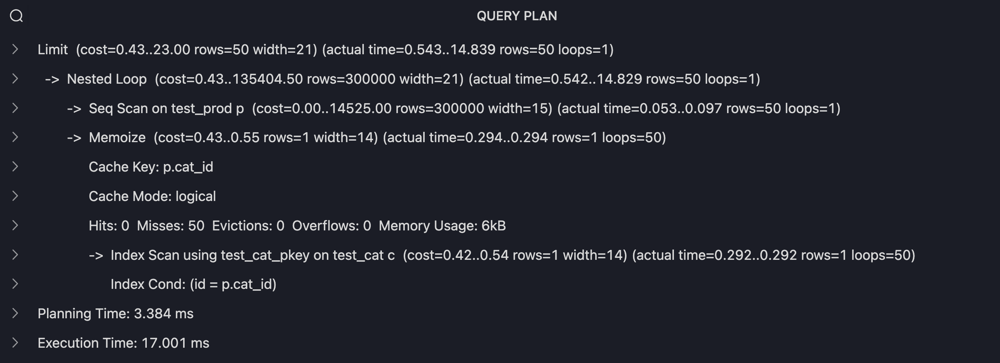

## prometheus

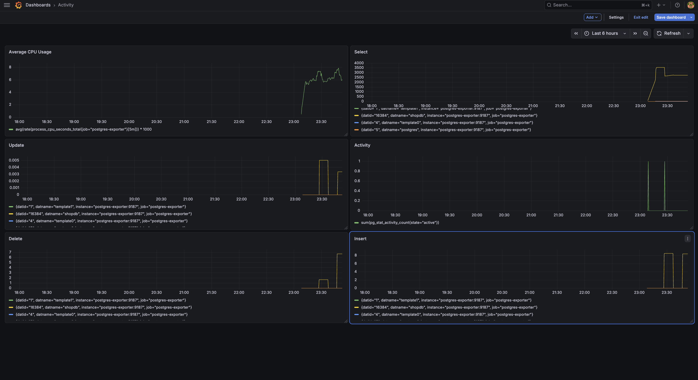
