## Insert

### так будем смотреть

найдем ctid и будем дальше работать с расширением

```
	SELECT xmin, xmax, ctid, high_card
	FROM test_cat
	WHERE high_card = 'cat_1'
```

```
INSERT INTO test_cat
(high_card, low_card, num_range, fulltext, jsonb_col, tstzrange_col, point_col)
VALUES
('test2','A',15.5,'test text','{"a":1}','[2024-01-01,2024-12-31]', '(5,5)');
```

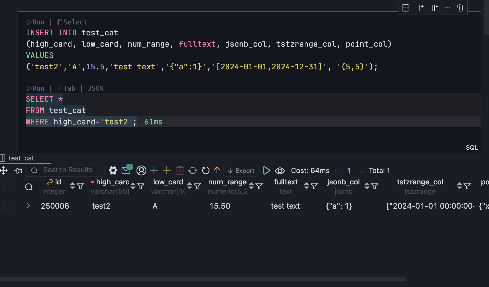
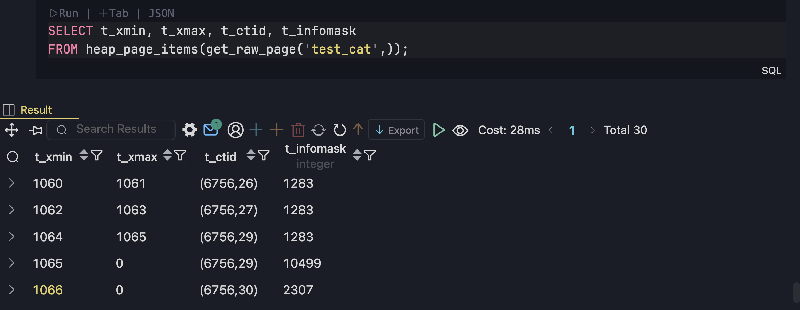

## update

```
UPDATE test_cat set fulltext = 'full text' WHERE id = 250005;
```

так как update = insert в новой строке
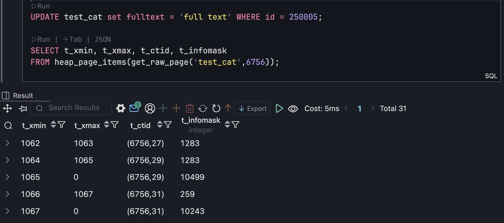

## delete

```
	DELETE FROM test_cat
	WHERE high_card = 'test2';
```

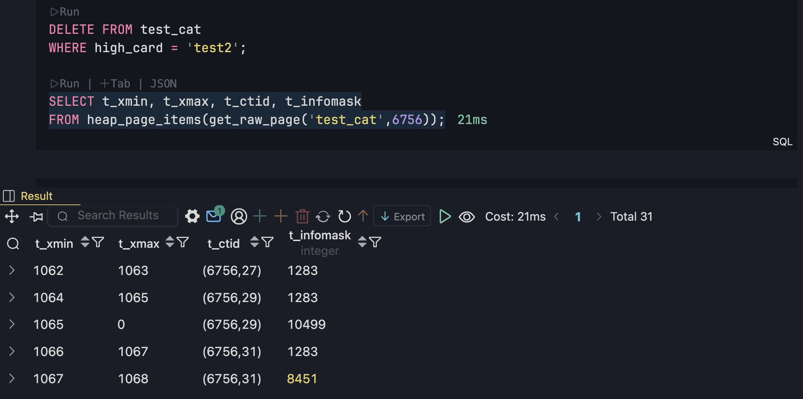

## Значение t_infomask представляет собой битовую маску, где каждая

HEAP_HASNULL 1
HEAP_HASVARWIDTH 2
HEAP_HASEXTERNAL 4
HEAP_HASOID_OLD 8
HEAP_XMAX_KEYSHR_LOCK 16
HEAP_COMBOCID 32
HEAP_XMAX_EXCL_LOCK 64
HEAP_XMAX_LOCK_ONLY 128
HEAP_XMIN_COMMITTED 256
HEAP_XMIN_INVALID 512
HEAP_XMAX_COMMITTED 1024
HEAP_XMAX_INVALID 2048
HEAP_UPDATED 4096

2307 = 2048 + 256 + 2 + 1
259 = 256 + 2 + 1
10243 = 8192 + 2048 + 2 + 1
1283 = 1024 + 256 + 2 + 1
8451 = 8192 + 256 + 2 + 1

## Просмотр в транзакции

создал новую таблицу, вставил и прочитал ее с xmin, xmax, ctid
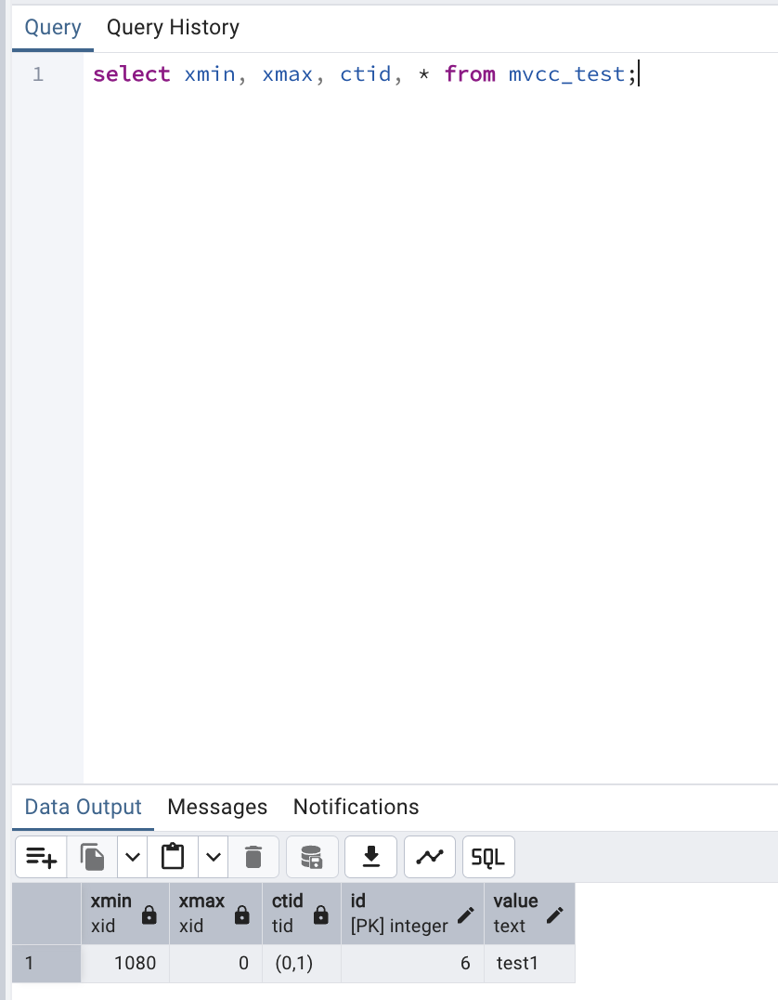

```
	BEGIN;

	UPDATE mvcc_test
	SET value = 'test2'
	WHERE id = 1;

	SELECT xmin, xmax, ctid, value
	FROM mvcc_test;
```

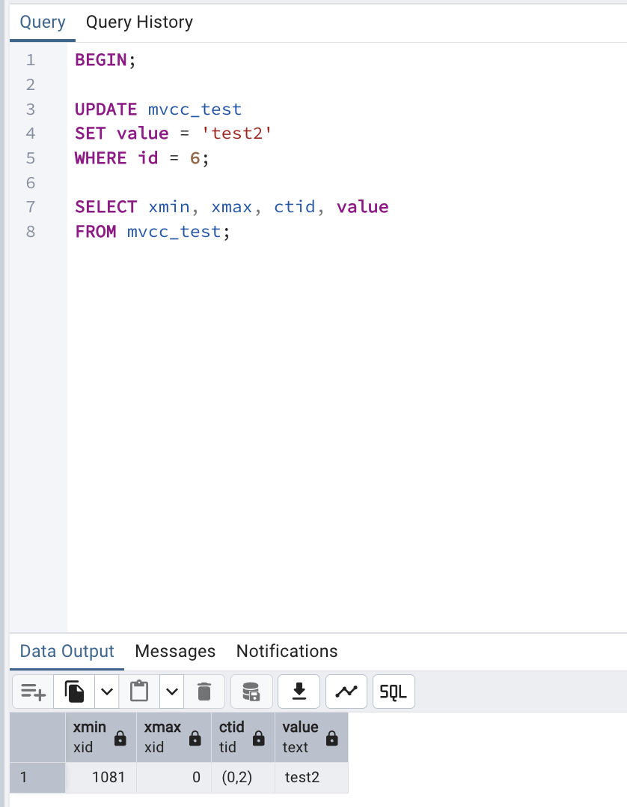

```
	BEGIN;
	SELECT xmin, xmax, ctid, value
	FROM mvcc_test;
```

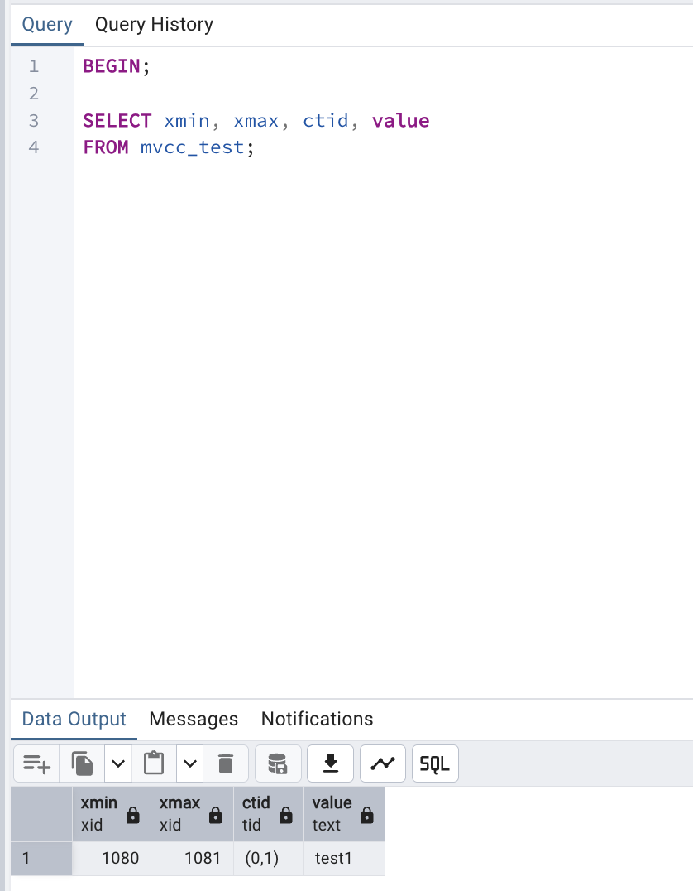

и после commit первого, у нас при поторном вызове во втором данные изменятся

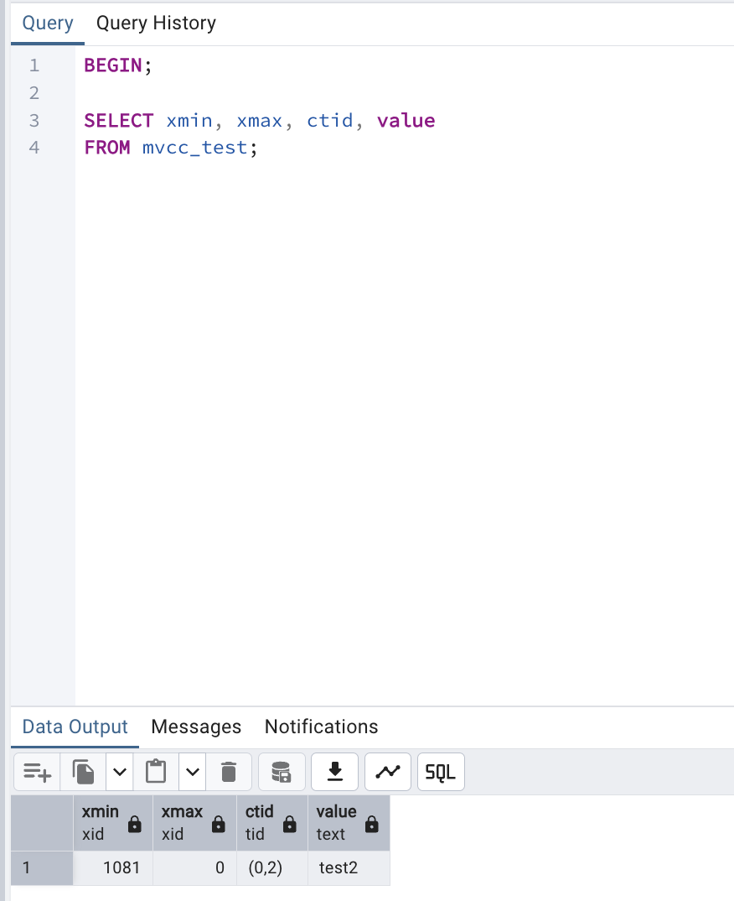

## deadlock

```
	BEGIN;

	UPDATE deadlock_test
	SET value = 'T1'
	WHERE id = 1;

	------------

	UPDATE deadlock_test
	SET value = 'T1'
	WHERE id = 2;
```

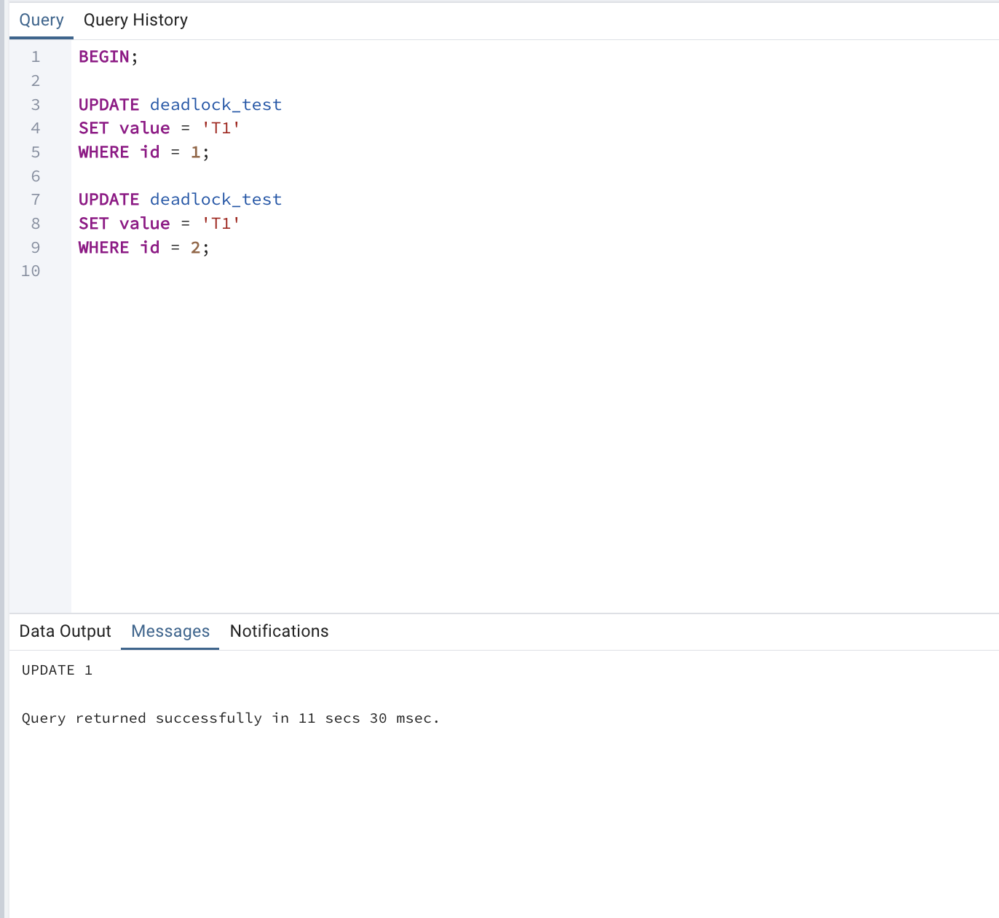

```
	BEGIN;

	UPDATE deadlock_test
	SET value = 'T2'
	WHERE id = 2;

	------------

	UPDATE deadlock_test
	SET value = 'T2'
	WHERE id = 1;

```

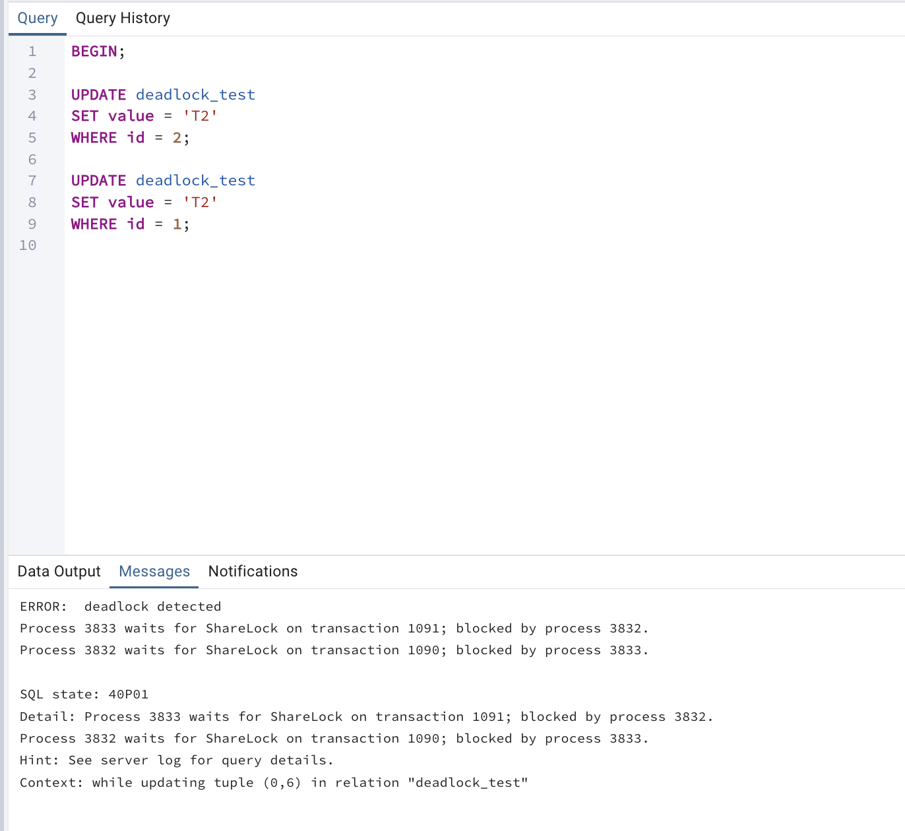

СУБД блокирует работу транзакции, не давая сделать дедлок

## Режимы блокировок

```
	CREATE TABLE row_lock_test (
    id INT PRIMARY KEY,
    value TEXT
	);

	INSERT INTO row_lock_test VALUES
	(1,'A'),
	(2,'B');
```

### for update

```
	BEGIN;

	SELECT *
	FROM row_lock_test
	WHERE id = 1
	FOR UPDATE;
```

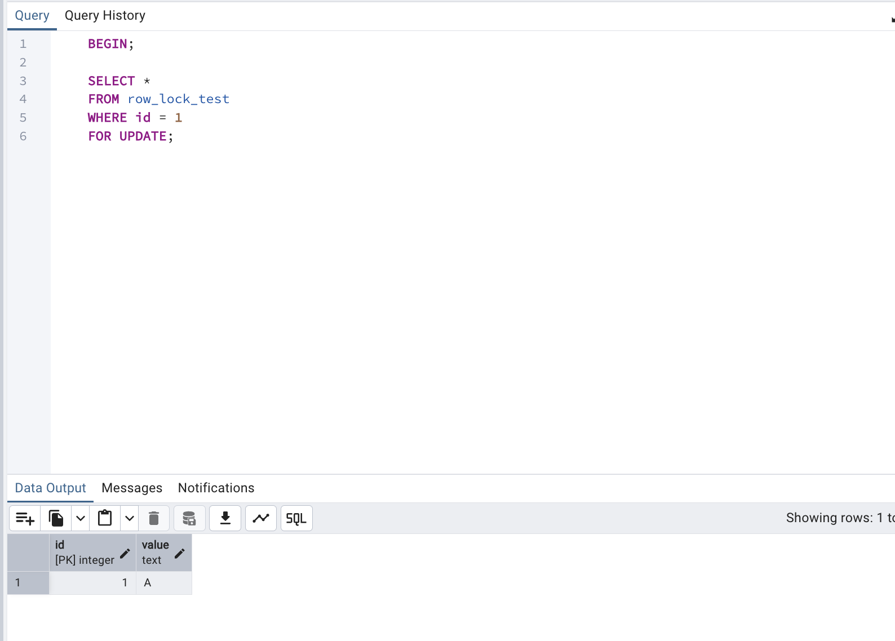

```
	SELECT *
	FROM row_lock_test
	WHERE id = 1
	FOR UPDATE;
```

ждет выполнения (окончания) второй транзакции


### for no key update

```
	BEGIN;

	SELECT *
	FROM row_lock_test
	WHERE id = 1
	FOR NO KEY UPDATE;
```

```
	SELECT *
	FROM row_lock_test
	WHERE id = 1
	FOR UPDATE;
```

аналогично ждет

### for share

```
	BEGIN;

	SELECT *
	FROM row_lock_test
	WHERE id = 1
	FOR SHARE;
```

```
	SELECT *
	FROM row_lock_test
	WHERE id = 1
	FOR SHARE;
```

нету конфликтов, они совместимы между собой

## for key share

```
	BEGIN;

	SELECT *
	FROM row_lock_test
	WHERE id = 1
	FOR KEY SHARE;
```

```
	SELECT *
	FROM row_lock_test
	WHERE id = 1
	FOR KEY SHARE;
```

## типичный конфликт на разные методы

```
	SELECT *
	FROM row_lock_test
	WHERE id = 1
	FOR UPDATE;
```


```
	BEGIN;
	SELECT *
	FROM row_lock_test
	WHERE id = 1
	FOR SHARE;
```

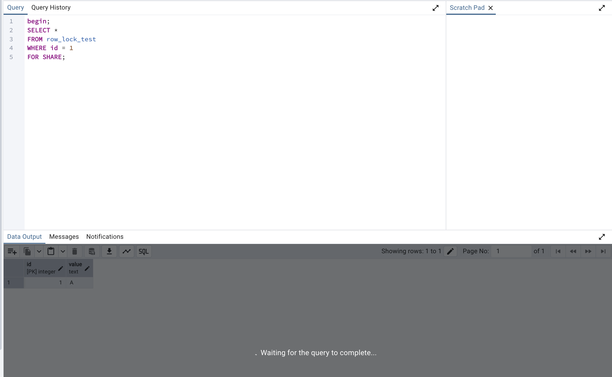

## очистка данных

```
SELECT relname,
       n_live_tup AS живых_строк,
       n_dead_tup AS мёртвых_строк,
       last_vacuum,
       last_autovacuum
FROM pg_stat_all_tables
WHERE relname = 'test';
```

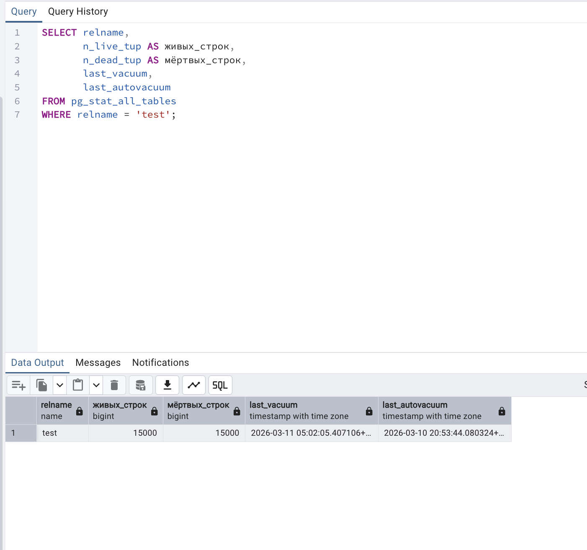

```
	vacuum verbose test;
```

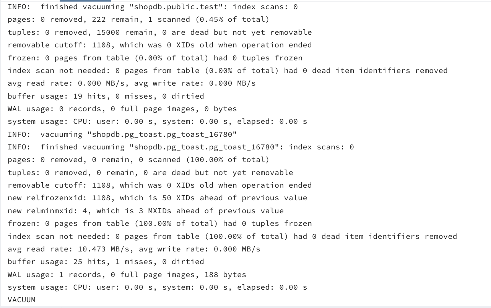

```
SELECT relname,
       n_live_tup AS живых_строк,
       n_dead_tup AS мёртвых_строк,
       last_vacuum,
       last_autovacuum
FROM pg_stat_all_tables
WHERE relname = 'test';
```

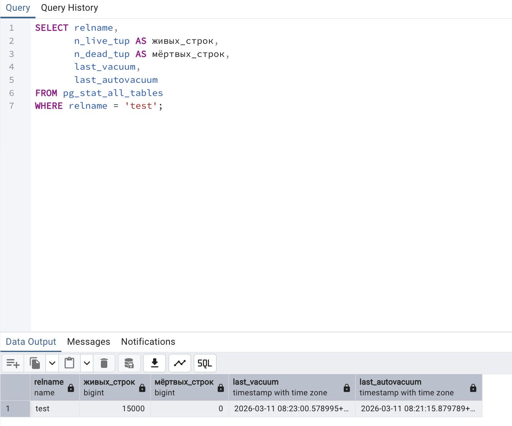

```
	select pg_size_pretty(pg_total_relation_size('test')) as размер_до;
```

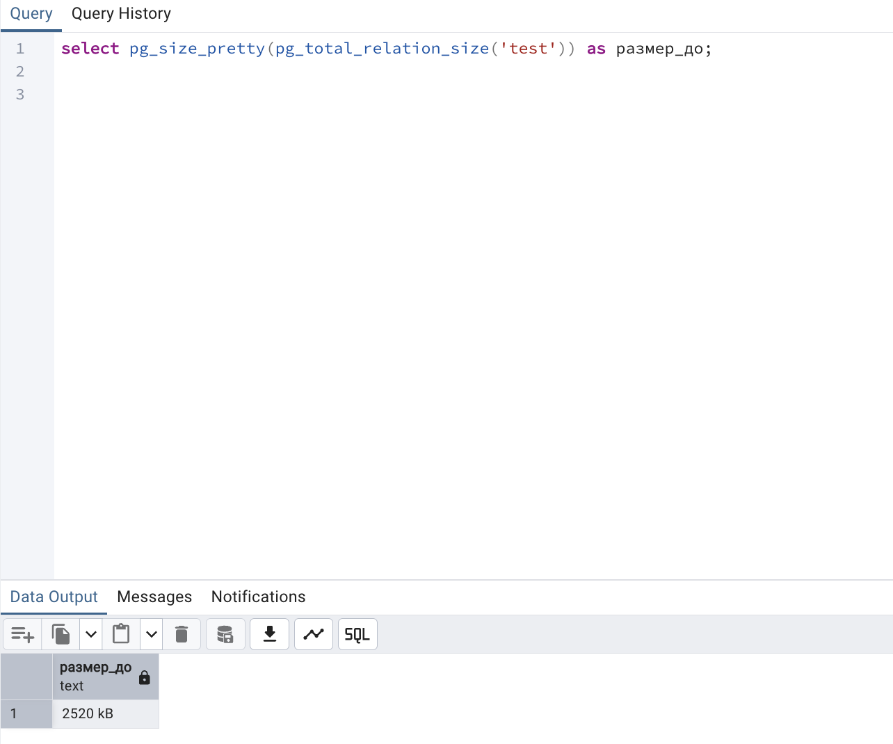

```
	VACUUM FULL test;
```

```
	select pg_size_pretty(pg_total_relation_size('test')) as размер_после;
```

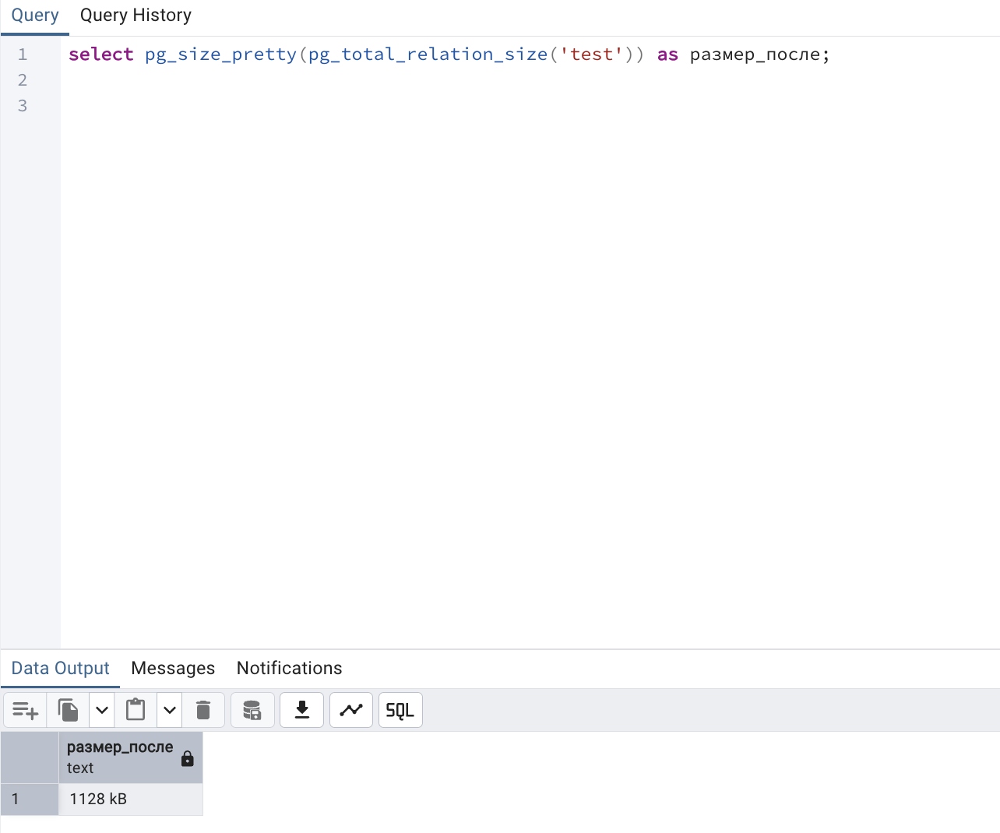
