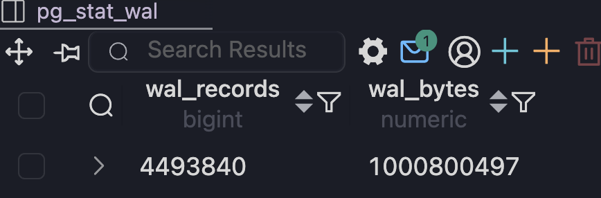
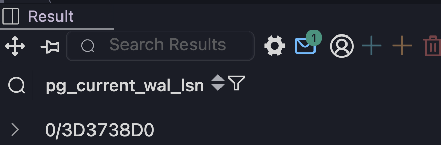
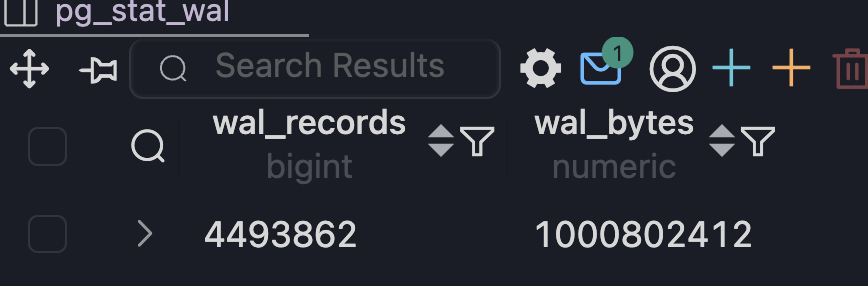
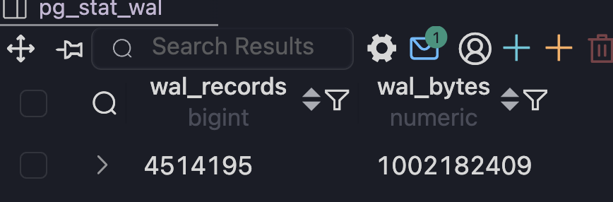
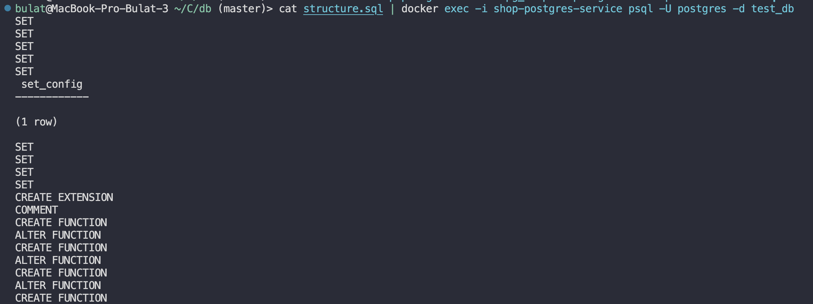
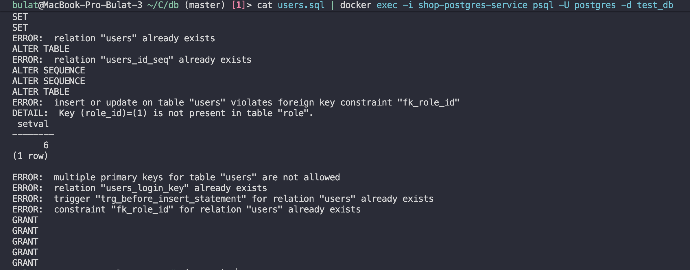
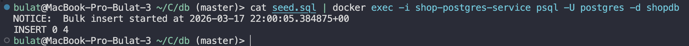
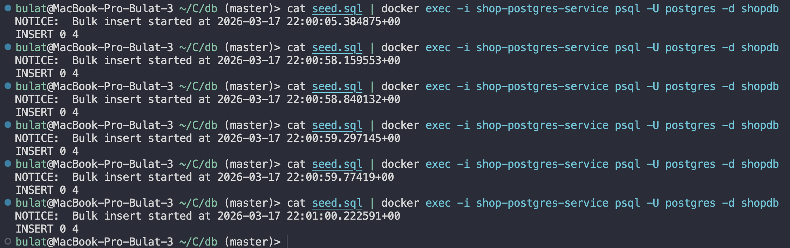

```
	CREATE TABLE wal_test (
    id SERIAL PRIMARY KEY,
    data TEXT
	);
```

## проанализируем lsn

```
	SELECT pg_current_wal_lsn();
	INSERT INTO wal_test (data) VALUES ('abc');
	SELECT pg_current_wal_lsn();
```


```
	SELECT pg_wal_lsn_diff('0/3D373418', '0/3D373270');
```

Столько байт записалось


## проверим wal в транзакции

```
	SELECT wal_records, wal_bytes FROM pg_stat_wal;
	BEGIN;
	INSERT INTO wal_test (data) VALUES ('tx test');
	SELECT wal_records, wal_bytes FROM pg_stat_wal;
	COMMIT;
	SELECT wal_records, wal_bytes FROM pg_stat_wal;
```




если посмотреть по lsn, то



спустя время если вызвать не завершая коммит, то он обновится это связано с тем, что wal не всегда сразу обновляется в основном с задержкой


## массовые действия

```
	SELECT wal_records, wal_bytes FROM pg_stat_wal;
	INSERT INTO wal_test (data)
	SELECT 'bulk ' || generate_series(1,10000);
	SELECT wal_records, wal_bytes FROM pg_stat_wal;

```




```
	docker exec -t shop-postgres-service pg_dump -U postgres -s shopdb > structure.sql
	cat structure.sql | docker exec -i shop-postgres-service psql -U postgres -d test_db
```



```
	docker exec -t shop-postgres-service pg_dump -U postgres -t users shopdb > users.sql
	cat users.sql | docker exec -i shop-postgres-service psql -U postgres -d test_db
```



```
	cat seed.sql | docker exec -i shop-postgres-service psql -U postgres -d shopdb
```



