# Физическая реплика

```
	docker compose -f docker-compose.repl.yml up -d
	docker ps
```

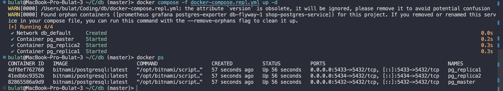

## Проверка репликации

```
	docker exec -it pg_master psql -U postgres -d shopdb -c "select application_name, state from pg_stat_replication;"
```

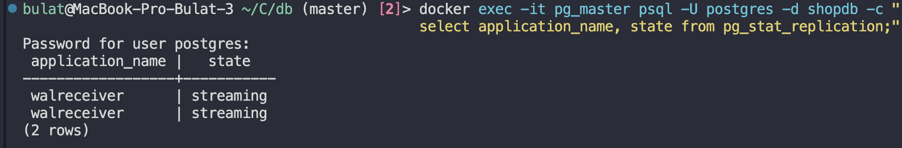

## Вставка данных и проверка на реплике

```
	docker exec -it pg_master psql -U postgres -d shopdb -c "
	insert into products(name) values ('phone'), ('laptop');"
```

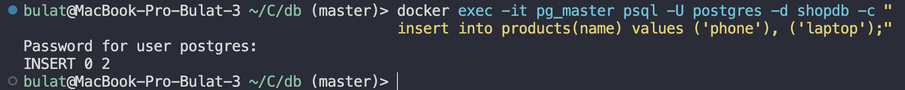

```
	docker exec -it pg_replica1 psql -U postgres -d shopdb -c "
	select * from products;"
```

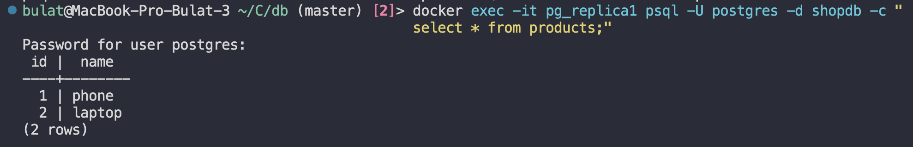

## Проверка ошибки вставки

```
	docker exec -it pg_replica1 psql -U postgres -d shopdb -c "
  insert into products(name) values ('fail');"
```

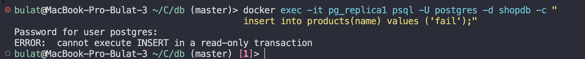

## Проверка LAG

```
	docker exec -it pg_master psql -U postgres -d shopdb -c "
  insert into products(name)
  select 'bulk_' || g from generate_series(1,50000) g;"
```

```
	docker exec -it pg_master psql -U postgres -d shopdb -c "
  select write_lag, replay_lag from pg_stat_replication;"
```

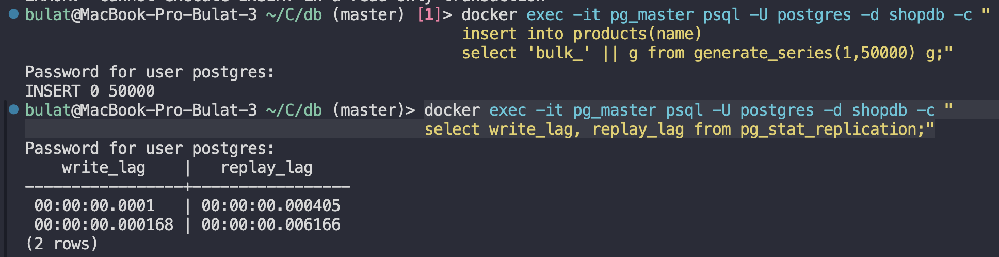

# Логическая реплика

```
	docker compose -f docker-compose.logical.yml up -d
	docker ps
```

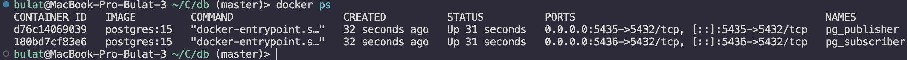

## Подготовка publisher

```
	docker exec -it pg_publisher psql -U postgres -d shopdb -c "show wal_level;"
	docker exec -it pg_publisher psql -U postgres -d shopdb -c "alter system set wal_level = logical;"
	docker exec -it pg_publisher psql -U postgres -d shopdb -c "alter system set max_replication_slots = 10;"
	docker exec -it pg_publisher psql -U postgres -d shopdb -c "alter system set max_wal_senders = 10;"
	docker restart pg_publisher
```


## Создание пользователя для репликации

```
	docker exec -it pg_publisher psql -U postgres -d shopdb -c "create role replicator with login replication password 'replicator_pass';"
```

## Создание publisher

```
	docker exec -it pg_publisher psql -U postgres -d shopdb -c "create table if not exists lr_test(id int, note text);"
	docker exec -it pg_publisher psql -U postgres -d shopdb -c "create publication pub_lr for table lr_test;"
```

## Создание таблицы на subscriber

```
	docker exec -it pg_subscriber psql -U postgres -d shopdb -c "create table if not exists lr_test(id int, note text);"
```

## Создание subscriber

```
	docker exec -it pg_subscriber psql -U postgres -d shopdb -c "create subscription sub_lr connection 'host=pg_publisher port=5432 dbname=shopdb user=replicator password=replicator_pass' publication pub_lr;"
```

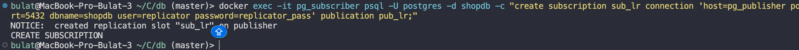

## Проверка работоспособности

```
	docker exec -it pg_publisher psql -U postgres -d shopdb -c "
  insert into lr_test values (10, 'works');"

	docker exec -it pg_subscriber psql -U postgres -d shopdb -c "
  select * from lr_test;"
```

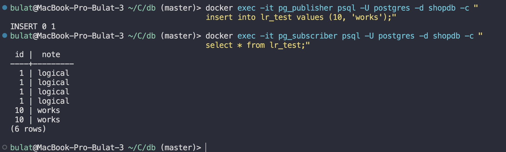

## ddl не реплицируется

```
	docker exec -it pg_publisher psql -U postgres -d shopdb -c "alter table lr_test add column extra text;"
	docker exec -it pg_subscriber psql -U postgres -d shopdb -c "select column_name from information_schema.columns where table_name='lr_test' order by ordinal_position;"
```

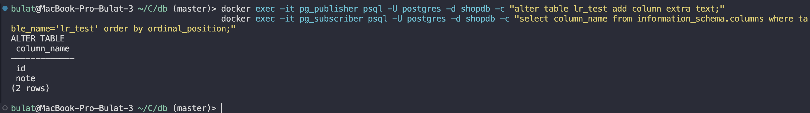

## Проверка REPLICA IDENTITY

```
	docker exec -it pg_publisher psql -U postgres -d shopdb -c "create table if not exists lr_no_pk(id int, note text);"
	docker exec -it pg_publisher psql -U postgres -d shopdb -c "alter publication pub_lr add table lr_no_pk;"
	docker exec -it pg_subscriber psql -U postgres -d shopdb -c "create table if not exists lr_no_pk(id int, note text);"

	docker exec -it pg_publisher psql -U postgres -d shopdb -c "insert into lr_no_pk values (1, 'a');"

	docker exec -it pg_publisher psql -U postgres -d shopdb -c "insert into lr_no_pk values (1, 'a');"
```

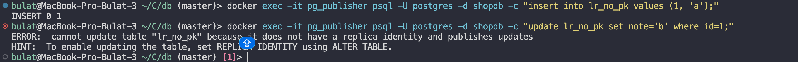

## Проверка статуса репликации

```
	docker exec -it pg_publisher psql -U postgres -d shopdb -c "select application_name, state, sync_state from pg_stat_replication;"
```

```
	docker exec -it pg_subscriber psql -U postgres -d shopdb -c "select srrelid::regclass as table_name, srsubstate from pg_subscription_rel;"
```

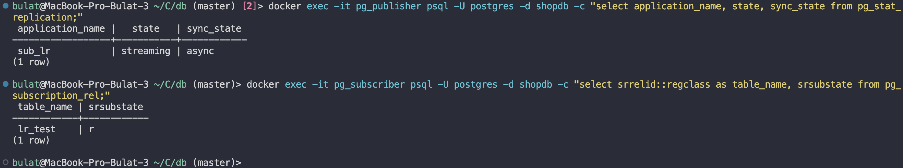

## Зачем тут нужны pg_dump/pg_restore

Логическая репликация не переносит DDL, поэтому pg_dump/pg_restore
нужны для первичного переноса схемы на subscriber перед созданием subscription,
синхронизации схемы после изменений DDL на publisher.

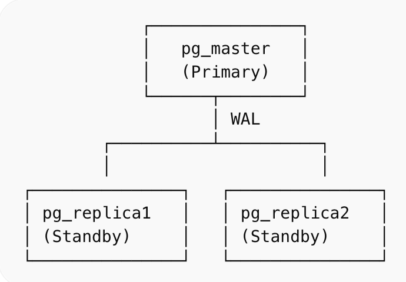
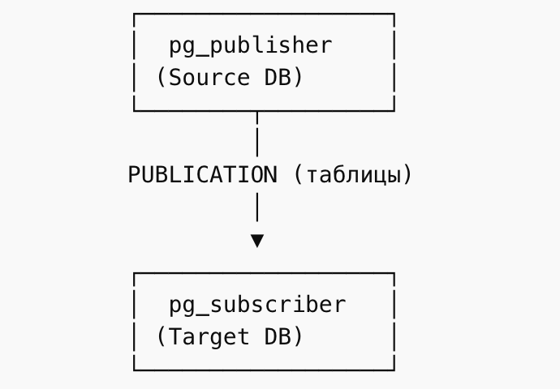
