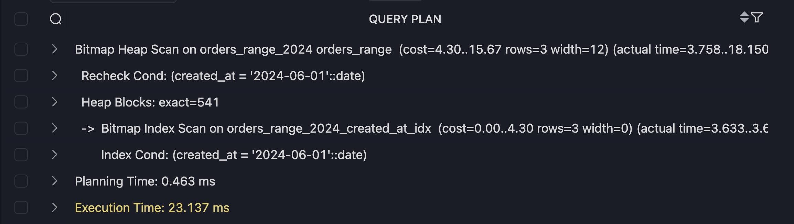
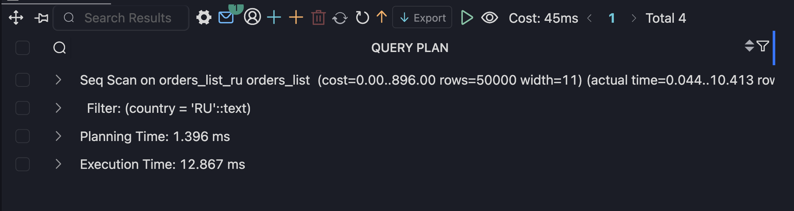
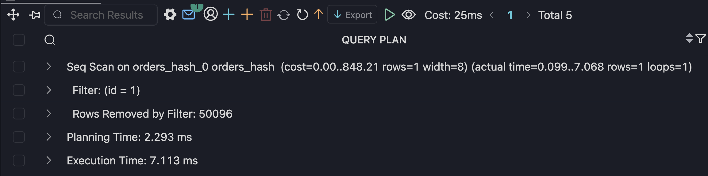
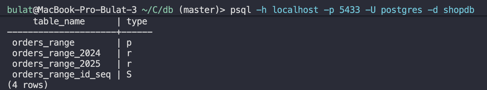
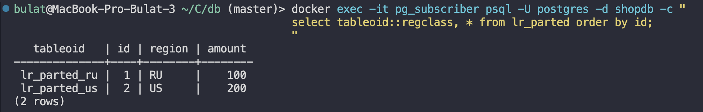
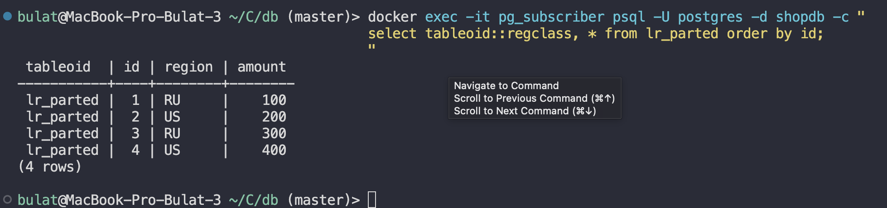
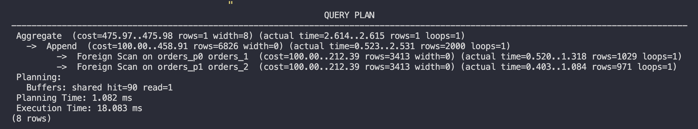
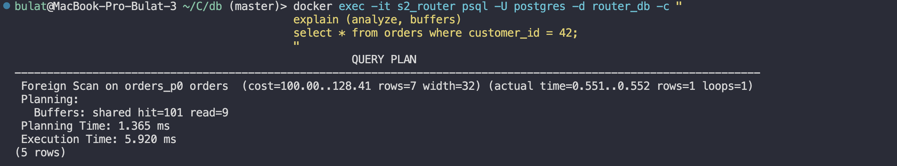
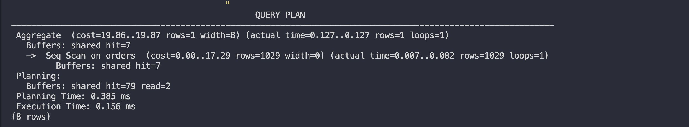

## Задание 1

```sql
CREATE TABLE orders_range (
    id serial,
    created_at date,
    amount int
) PARTITION BY RANGE (created_at);

CREATE TABLE orders_range_2024
PARTITION OF orders_range
FOR VALUES FROM ('2024-01-01') TO ('2025-01-01');

CREATE TABLE orders_range_2025
PARTITION OF orders_range
FOR VALUES FROM ('2025-01-01') TO ('2026-01-01');

INSERT INTO orders_range (created_at, amount)
SELECT
    '2024-06-01',
    generate_series(1, 100000);

CREATE INDEX idx_range_date ON orders_range (created_at);

EXPLAIN ANALYZE
SELECT * FROM orders_range
WHERE created_at = '2024-06-01';
```



Partition pruning: ДА
Партиций: 1
Индекс: используется

```sql
CREATE TABLE orders_list (
    id serial,
    country text,
    amount int
) PARTITION BY LIST (country);

CREATE TABLE orders_list_ru
PARTITION OF orders_list
FOR VALUES IN ('RU');

CREATE TABLE orders_list_us
PARTITION OF orders_list
FOR VALUES IN ('US');

INSERT INTO orders_list (country, amount)
SELECT
    CASE
        WHEN i % 2 = 0 THEN 'RU'
        ELSE 'US'
    END,
    i
FROM generate_series(1, 100000) AS i;

EXPLAIN ANALYZE
SELECT * FROM orders_list
WHERE country = 'RU';
```



Partition pruning: ДА
Партиций: 1
Индекс: не используется

```sql
CREATE TABLE orders_hash (
    id int,
    amount int
) PARTITION BY HASH (id);

CREATE TABLE orders_hash_0
PARTITION OF orders_hash
FOR VALUES WITH (MODULUS 2, REMAINDER 0);

CREATE TABLE orders_hash_1
PARTITION OF orders_hash
FOR VALUES WITH (MODULUS 2, REMAINDER 1);

INSERT INTO orders_hash (id, amount)
SELECT
    i,
    i * 10
FROM generate_series(1, 100000) AS i;

EXPLAIN ANALYZE
SELECT * FROM orders_hash
WHERE id = 1;
```



## Задание 2


Думаю очевидно, что таблицы там есть, так как копируется через WAL

Почему репликация не знает про секции:
потому что физическая репликация работает на уровне WAL (физических изменений),
и не оперирует логическими объектами, такими как partitioned tables.
Для реплики каждая партиция — это обычная таблица.

## Задание 3

```bash
docker exec -it pg_publisher psql -U postgres -d shopdb -c "
drop table if exists lr_parted cascade;

create table lr_parted (
  id int not null,
  region text not null,
  amount int not null
) partition by list (region);

create table lr_parted_ru partition of lr_parted for values in ('RU');
create table lr_parted_us partition of lr_parted for values in ('US');
"
```

### publish_via_partition_root = OFF

```bash
docker exec -it pg_publisher psql -U postgres -d shopdb -c "
drop publication if exists pub_lr_parted;

create publication pub_lr_parted
for table lr_parted_ru, lr_parted_us
with (publish_via_partition_root = off);
"
```

SUBSCRIBER — такая же структура

```bash
docker exec -it pg_subscriber psql -U postgres -d shopdb -c "
drop table if exists lr_parted cascade;

create table lr_parted (
  id int not null,
  region text not null,
  amount int not null
) partition by list (region);

create table lr_parted_ru partition of lr_parted for values in ('RU');
create table lr_parted_us partition of lr_parted for values in ('US');
"
```

Создание subscription

```bash
docker exec -it pg_subscriber psql -U postgres -d shopdb -c "
drop subscription if exists sub_lr_parted;"

docker exec -it pg_subscriber psql -U postgres -d shopdb -c "
create subscription sub_lr_parted
connection 'host=pg_publisher port=5432 dbname=shopdb user=postgres password=postgres'
publication pub_lr_parted;
"
```

Проверка

```bash
docker exec -it pg_publisher psql -U postgres -d shopdb -c "
insert into lr_parted values (1,'RU',100),(2,'US',200);
"
docker exec -it pg_subscriber psql -U postgres -d shopdb -c "
select tableoid::regclass, * from lr_parted order by id;
"
```



### publish_via_partition_root = ON

На publisher

```bash
docker exec -it pg_publisher psql -U postgres -d shopdb -c "
drop publication if exists pub_lr_parted_root;

create publication pub_lr_parted_root
for table lr_parted
with (publish_via_partition_root = on);
"
```

SUBSCRIBER — ТОЛЬКО root таблица

```bash
docker exec -it pg_subscriber psql -U postgres -d shopdb -c "
drop table if exists lr_parted cascade;

create table lr_parted (
  id int not null,
  region text not null,
  amount int not null
);
"
```

```bash
docker exec -it pg_subscriber psql -U postgres -d shopdb -c "
drop subscription if exists sub_lr_parted_root;"

docker exec -it pg_subscriber psql -U postgres -d shopdb -c "
create subscription sub_lr_parted_root
connection 'host=pg_publisher port=5432 dbname=shopdb user=postgres password=postgres'
publication pub_lr_parted_root
with (copy_data = true);
"
```

Проверка

```bash
docker exec -it pg_publisher psql -U postgres -d shopdb -c "
insert into lr_parted values (3,'RU',300),(4,'US',400);
"

docker exec -it pg_subscriber psql -U postgres -d shopdb -c "
select tableoid::regclass, * from lr_parted order by id;
"
```



## Задание 4 postgres_fdw

Shard 1:

```bash
docker exec -it s2_shard1 psql -U postgres -d shard1_db -c "
drop table if exists orders;
create table orders (
  id bigserial primary key,
  customer_id int not null,
  order_date date not null,
  amount numeric(10,2) not null
);
create index on orders (customer_id);
"
```

Shard 2:

```bash
docker exec -it s2_shard2 psql -U postgres -d shard2_db -c "
drop table if exists orders;
create table orders (
  id bigserial primary key,
  customer_id int not null,
  order_date date not null,
  amount numeric(10,2) not null
);
create index on orders (customer_id);
"
```

Настройка FDW и маршрутизатора (router)

```bash
docker exec -it s2_router psql -U postgres -d router_db -c "
create extension if not exists postgres_fdw;

drop server if exists shard1 cascade;
drop server if exists shard2 cascade;

create server shard1 foreign data wrapper postgres_fdw
  options (host 'shard1', port '5432', dbname 'shard1_db');
create server shard2 foreign data wrapper postgres_fdw
  options (host 'shard2', port '5432', dbname 'shard2_db');

create user mapping for postgres server shard1 options (user 'postgres', password 'postgres');
create user mapping for postgres server shard2 options (user 'postgres', password 'postgres');

drop table if exists orders cascade;
create table orders (
  id bigserial not null,
  customer_id int not null,
  order_date date not null,
  amount numeric(10,2) not null
) partition by hash (customer_id);

create foreign table orders_p0 partition of orders
  for values with (modulus 2, remainder 0)
  server shard1 options (schema_name 'public', table_name 'orders');

create foreign table orders_p1 partition of orders
  for values with (modulus 2, remainder 1)
  server shard2 options (schema_name 'public', table_name 'orders');
"
```

Заполнение через router

```sql
docker exec -it s2_router psql -U postgres -d router_db -c "
insert into orders (customer_id, order_date, amount)
select g, date '2024-01-01' + (g % 30), (random()*1000)::numeric(10,2)
from generate_series(1, 2000) g;
"
```

Простой запрос на все данные (router)

```bash
docker exec -it s2_router psql -U postgres -d router_db -c "
explain (analyze, buffers)
select count(*) from orders;
"
```



Простой запрос на один шард (router)

```bash
docker exec -it s2_router psql -U postgres -d router_db -c "
explain (analyze, buffers)
select * from orders where customer_id = 42;
"
```



Простой запрос напрямую к шарду

```bash
docker exec -it s2_shard1 psql -U postgres -d shard1_db -c "
explain (analyze, buffers)
select count(*) from orders;
"
```


