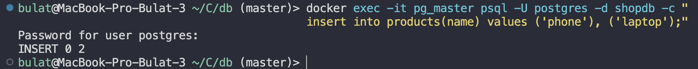
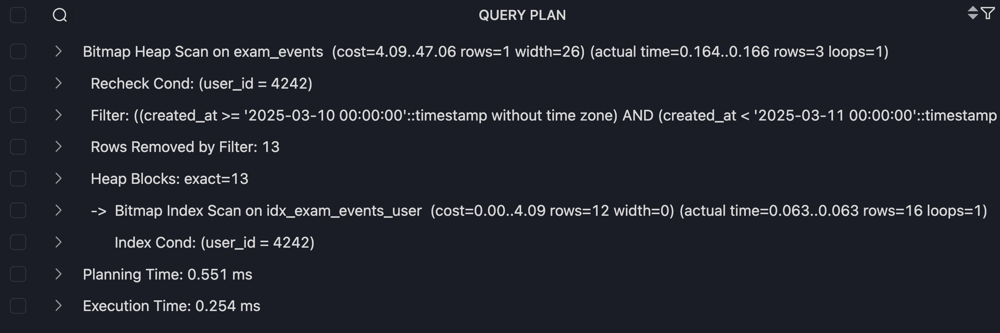
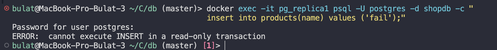
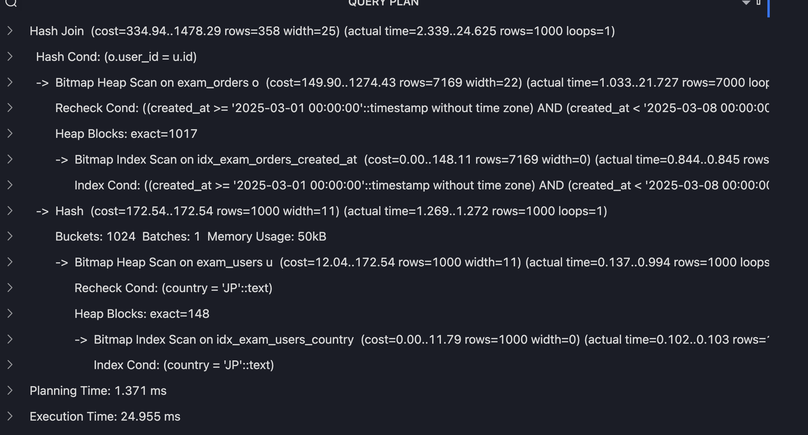
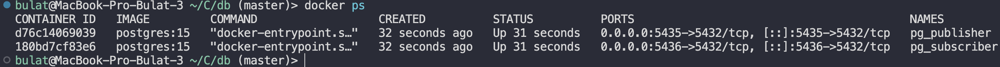
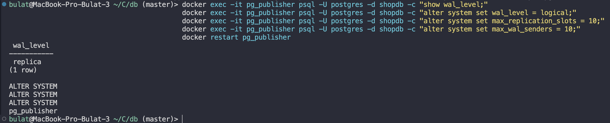
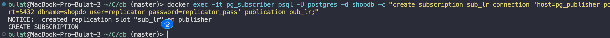

# OLAP-модель для существующей OLTP-схемы

В проекте уже есть OLTP-таблицы из docker-compose.yml

- `test_cat` - категории товаров
- `test_prod` - товары
- `test_cust` - клиенты
- `test_orders` - заказы

## Задание 1. Выбрать 2-3 аналитических вопроса

Для этой схемы интернет-магазина выбраны такие аналитические вопросы:

1. Какая динамика заказов и выручки по дням?
2. Какие товары и категории самые популярные по количеству заказов?
3. Сколько заказов и на какую сумму совершают пользователи разных типов?

## Задание 2. Определить один главный факт

Главный факт: `olap.fact_orders`.

Факт строится на основе OLTP-таблицы `test_orders`.

## Задание 3. Определить зерно факта

Зерно факта:

**1 строка = один заказ.**

Каждая строка `fact_orders` соответствует одной строке из `test_orders`.

## Задание 4. Создать 2-4 измерения

Создаются 4 измерения:

`olap.dim_date` - календарная дата заказа
`olap.dim_user` - клиент
`olap.dim_product` - товар
`olap.dim_category` - категория товара

```sql
DROP SCHEMA IF EXISTS olap CASCADE;
CREATE SCHEMA olap;

CREATE TABLE olap.dim_date (
    date_key INTEGER PRIMARY KEY,
    full_date DATE NOT NULL,
    year INTEGER NOT NULL,
    quarter INTEGER NOT NULL,
    month INTEGER NOT NULL,
    day INTEGER NOT NULL,
    week INTEGER NOT NULL,
    weekday INTEGER NOT NULL
);

CREATE TABLE olap.dim_user (
    user_key INTEGER PRIMARY KEY,
    user_code VARCHAR(40) NOT NULL,
    user_type VARCHAR(8) NOT NULL,
    balance NUMERIC(6,2),
    has_referral BOOLEAN NOT NULL
);

CREATE TABLE olap.dim_category (
    category_key INTEGER PRIMARY KEY,
    category_code VARCHAR(50) NOT NULL,
    category_type VARCHAR(10) NOT NULL,
    category_score NUMERIC(5,2)
);

CREATE TABLE olap.dim_product (
    product_key INTEGER PRIMARY KEY,
    category_key INTEGER REFERENCES olap.dim_category(category_key),
    product_code VARCHAR(30) NOT NULL,
    product_type VARCHAR(5) NOT NULL,
    product_price NUMERIC(4,1)
);

CREATE TABLE olap.fact_orders (
    order_key INTEGER PRIMARY KEY,
    date_key INTEGER NOT NULL REFERENCES olap.dim_date(date_key),
    user_key INTEGER NOT NULL REFERENCES olap.dim_user(user_key),
    product_key INTEGER NOT NULL REFERENCES olap.dim_product(product_key),
    category_key INTEGER NOT NULL REFERENCES olap.dim_category(category_key),
    order_code VARCHAR(30) NOT NULL,
    order_status VARCHAR(10) NOT NULL,
    order_amount NUMERIC(6,2) NOT NULL,
    items_count INTEGER,
    has_promo BOOLEAN,
    order_start_at TIMESTAMPTZ,
    order_end_at TIMESTAMPTZ
);
```



## Задание 5. Заполнить OLAP-таблицы из OLTP-таблиц

### dim_date

Дата заказа берется из начала диапазона, а данные в целом берутся из test_orders

```sql
INSERT INTO olap.dim_date (
    date_key,
    full_date,
    year,
    quarter,
    month,
    day,
    week,
    weekday
)
SELECT DISTINCT
    TO_CHAR(LOWER(tstzrange_col)::DATE, 'YYYYMMDD')::INTEGER AS date_key,
    LOWER(tstzrange_col)::DATE AS full_date,
    EXTRACT(YEAR FROM LOWER(tstzrange_col))::INTEGER AS year,
    EXTRACT(QUARTER FROM LOWER(tstzrange_col))::INTEGER AS quarter,
    EXTRACT(MONTH FROM LOWER(tstzrange_col))::INTEGER AS month,
    EXTRACT(DAY FROM LOWER(tstzrange_col))::INTEGER AS day,
    EXTRACT(WEEK FROM LOWER(tstzrange_col))::INTEGER AS week,
    EXTRACT(ISODOW FROM LOWER(tstzrange_col))::INTEGER AS weekday
FROM test_orders
WHERE tstzrange_col IS NOT NULL
  AND NOT ISEMPTY(tstzrange_col)
  AND LOWER(tstzrange_col) IS NOT NULL;
```

### dim_user

```sql
INSERT INTO olap.dim_user (
    user_key,
    user_code,
    user_type,
    balance,
    has_referral
)
SELECT
    id AS user_key,
    high_card AS user_code,
    low_card AS user_type,
    num_range AS balance,
    null_col IS NOT NULL AS has_referral
FROM test_cust;
```

### dim_category

```sql
INSERT INTO olap.dim_category (
    category_key,
    category_code,
    category_type,
    category_score
)
SELECT
    id AS category_key,
    high_card AS category_code,
    low_card AS category_type,
    num_range AS category_score
FROM test_cat;
```

### dim_product

```sql
INSERT INTO olap.dim_product (
    product_key,
    category_key,
    product_code,
    product_type,
    product_price
)
SELECT
    id AS product_key,
    cat_id AS category_key,
    high_card AS product_code,
    low_card AS product_type,
    num_range AS product_price
FROM test_prod;
```

### fact_orders

```sql
INSERT INTO olap.fact_orders (
    order_key,
    date_key,
    user_key,
    product_key,
    category_key,
    order_code,
    order_status,
    order_amount
)
SELECT
    o.id,
    TO_CHAR(LOWER(o.tstzrange_col)::DATE, 'YYYYMMDD')::INTEGER,
    o.cust_id,
    o.prod_id,
    p.cat_id,
    o.high_card,
    o.low_card,
    o.num_range
FROM test_orders o
JOIN test_prod p ON p.id = o.prod_id
WHERE NOT ISEMPTY(o.tstzrange_col);
```



```sql
CREATE INDEX idx_fact_orders_date_key ON olap.fact_orders(date_key);
CREATE INDEX idx_fact_orders_user_key ON olap.fact_orders(user_key);
CREATE INDEX idx_fact_orders_product_key ON olap.fact_orders(product_key);
CREATE INDEX idx_fact_orders_category_key ON olap.fact_orders(category_key);
CREATE INDEX idx_fact_orders_status ON olap.fact_orders(order_status);
```

## Задание 6. Написать минимум 3 аналитических запроса

### Запрос 1. Динамика заказов и выручки по дням

```sql
SELECT
    d.full_date,
    COUNT(*) AS orders_count,
    SUM(f.order_amount) AS revenue,
    ROUND(AVG(f.order_amount), 2) AS avg_order_amount
FROM olap.fact_orders f
JOIN olap.dim_date d ON d.date_key = f.date_key
GROUP BY d.full_date
ORDER BY d.full_date;
```



### Запрос 2. Самые популярные товары

```sql
SELECT
    p.product_code,
    p.product_type,
    COUNT(*) AS orders_count,
    SUM(f.items_count) AS total_items,
    SUM(f.order_amount) AS revenue
FROM olap.fact_orders f
JOIN olap.dim_product p ON p.product_key = f.product_key
GROUP BY p.product_code, p.product_type
ORDER BY orders_count DESC, revenue DESC
LIMIT 10;
```



### Запрос 3. Активность пользователей по типам

```sql
SELECT
    u.user_type,
    COUNT(DISTINCT u.user_key) AS users_count,
    COUNT(*) AS orders_count,
    ROUND(COUNT(*)::NUMERIC / COUNT(DISTINCT u.user_key), 2) AS orders_per_user,
    SUM(f.order_amount) AS revenue,
    ROUND(AVG(f.order_amount), 2) AS avg_order_amount
FROM olap.fact_orders f
JOIN olap.dim_user u ON u.user_key = f.user_key
GROUP BY u.user_type
ORDER BY revenue DESC;
```

Запрос отвечает на вопрос, сколько действий совершают пользователи разных типов: `VIP`, `Reg`, `New`.



### Запрос 4. Популярность категорий

```sql
SELECT
    c.category_type,
    COUNT(*) AS orders_count,
    SUM(f.items_count) AS total_items,
    SUM(f.order_amount) AS revenue,
    ROUND(AVG(f.order_amount), 2) AS avg_order_amount
FROM olap.fact_orders f
JOIN olap.dim_category c ON c.category_key = f.category_key
GROUP BY c.category_type
ORDER BY orders_count DESC;
```



### Запрос 5. Распределение заказов по статусам

```sql
SELECT
    order_status,
    COUNT(*) AS orders_count,
    ROUND(COUNT(*) * 100.0 / SUM(COUNT(*)) OVER (), 2) AS status_percent,
    SUM(order_amount) AS revenue
FROM olap.fact_orders
GROUP BY order_status
ORDER BY orders_count DESC;
```


